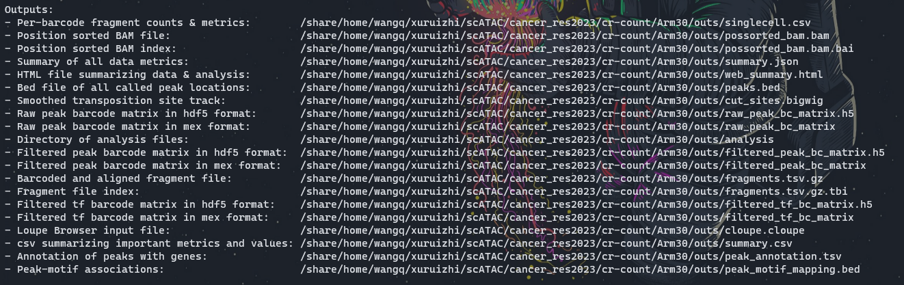
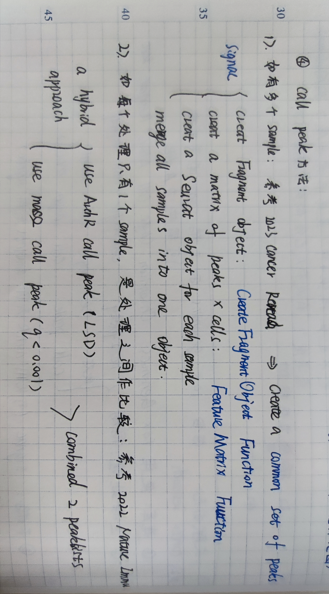

# cancer_res2023 
# Integrative Single-Cell Analysis Reveals Transcriptionaland Epigenetic Regulatory Features of Clear Cell Renal Cell Carcinoma

 
# 复现cancer_res2023中图片  
# [文章](https://pubmed.ncbi.nlm.nih.gov/36607615/)
# 数据：[GSE207493](https://www.ncbi.nlm.nih.gov/geo/query/acc.cgi?acc=GSE207493) 因为该文章数据为bam文件，接下来使用nature immu的数据
# 数据：[GSE199565](https://www.ncbi.nlm.nih.gov/geo/query/acc.cgi?acc=GSE199565)   


 


* 测序：DNA libraries were sequenced by NovaSeq 6000 (Illumina). Consistent with previous studies, we followed the 250 paired-end sequencing scheme: 50 bp read 1N, 8 bp i7 index, 16 bp i5 index, and 50 bp read 2N.  

* [对于sample、flowcell区分](https://mp.weixin.qq.com/s?__biz=MzI1Njk4ODE0MQ==&mid=2247484206&idx=1&sn=edeebbdd092f79361aee87e9ce086d80&chksm=ea1f05acdd688cba4bb00b65e362db843f9867e40421bb334fc13be996c24afb2211a23adbb5&cur_album_id=2757379787522048003&scene=189#wechat_redirect)

## 软件下载
```bash
cd /mnt/d/biosoft
curl -o cellranger-atac-2.1.0.tar.gz "https://cf.10xgenomics.com/releases/cell-atac/cellranger-atac-2.1.0.tar.gz?Expires=1680819642&Policy=eyJTdGF0ZW1lbnQiOlt7IlJlc291cmNlIjoiaHR0cHM6Ly9jZi4xMHhnZW5vbWljcy5jb20vcmVsZWFzZXMvY2VsbC1hdGFjL2NlbGxyYW5nZXItYXRhYy0yLjEuMC50YXIuZ3oiLCJDb25kaXRpb24iOnsiRGF0ZUxlc3NUaGFuIjp7IkFXUzpFcG9jaFRpbWUiOjE2ODA4MTk2NDJ9fX1dfQ__&Signature=aVphthCFKlwHmOnTy1AB9Itk6pMya5bFMXqfbkFX7cwalMW9fEkOXdwA3eLyEdg2qgk~mkvjHpondK-RxPsCeAZ~u-8EFTazI3EebAu2uttycmkA-VHceAae37Bbpi9h~eGUb-qhrWvQQkEOzv6q2qlOs94hfQZhY-d~tVwBfeef0ujcQRWG6-Pc90YKbLdhABM3BdXJAZGP14RvZd8XZEyt4byRuXWYyVgIuQAbXzyuSRWJKEfBXoeX3uGBgwXjF3Ha~zacuQNKjBfB4l2ttNisfVVgTVzgBdrkQ8ZXtovnHtktU~rdMcwaGB8yTM8DmGYud0DKhmVD8uU4Hr7pfQ__&Key-Pair-Id=APKAI7S6A5RYOXBWRPDA"
tar -xzvf cellranger-atac-2.1.0.tar.gz
rm cellranger-atac-2.1.0.tar.gz
vim ~/.bashrc
export PATH=/mnt/d/biosoft/cellranger-atac-2.1.0:$PATH
source ~/.bashrc

cellranger-atac sitecheck > sitecheck.txt
cellranger-atac upload xuruizhi30454X@163.com sitecheck.txt
cellranger-atac testrun
```

## 在超算跑
* 将软件及下载好的数据传输到超算
```bash
rsync -av /mnt/d/scATAC/cancer_res2023/ \
wangq@202.119.37.251:/share/home/wangq/xuruizhi/scATAC/cancer_res2023
```
* 超算计算节点配置

型号：Flex X240M5   
2 颗 Intel E5-2680v3 CPU（2.5Ghz 12 核心）   
128GB 内存   
1 块 120GB SSD 盘   
1 个千兆以太网网口   
1 个 56Gb Infiniband 网口  

## 前处理 
[参考  CellRanger ATAC](https://support.10xgenomics.com/single-cell-atac/software/pipelines/latest/what-is-cell-ranger-atac)      

做前处理前，一定先确定好样本测序情况+重复情况，[详细参照](https://support.10xgenomics.com/single-cell-atac/software/pipelines/latest/what-is-cell-ranger-atac)。  

For example, if your experimental design involves `two samples`, you will have to run cellranger-atac count two times - once for each sample. Then you can aggregate them with a single instance of cellranger-atac aggr, as described in [Multi-Library Aggregation](https://support.10xgenomics.com/single-cell-atac/software/pipelines/latest/using/aggr).  


1. bcl2fastq  

* cellranger mkfastq ： 它借鉴了Illumina的bcl2fastq ，可以将一个或多个lane中的混样测序样本按照index标签生成样本对应的fastq文件。若已经获得了fastq文件，直接进行下一步即可    

* Preliminary sequencing files (.bcl) were converted to FASTQ files by CellRanger ATAC (version 1.2.0, https://support.10xgenomics.com/single-cell-atac/software/pipelines/
latest/ what-is-cell-ranger-atac) with the `cellranger-atac mkfastq` function.   

* cellranger-atac mkfastq demultiplexes raw base call (BCL) files generated by Illumina® sequencers into FASTQ files. It is a wrapper around bcl2fastq from Illumina®, with additional useful features that are specific to 10x Genomics libraries and a simplified sample sheet format.  

* Note that the term library and GEM well are treated as equivalent.  

```bash
$ cellranger-atac mkfastq --id=tiny-bcl \
                     --run=/path/to/tiny_bcl \
                     --samplesheet=cellranger-atac-tiny-bcl-samplesheet-1.0.0.csv
```
2. 下载测序及基因组数据    

下载`P14 CD8 T cells from LCMV Armstrong infection 15 days post infection`,`P14 CD8 T cells from LCMV Armstrong infection 30 days post infection`两组ATAC-seq及RNA-seq数据。SRR分别为 SRR18505563，SRR18505564，SRR18505387，SRR18505388.  


  

```bash
# sequence
echo "<=== downloading sequence ===>"
mkdir -p /mnt/d/scATAC/cancer_res2023/sequence
mkdir -p /mnt/d/scATAC/cancer_res2023/sequence/ATAC
mkdir -p /mnt/d/scATAC/cancer_res2023/sequence/RNA
cd ~/data/sra
prefetch SRR18505563 SRR18505564 SRR18505387 SRR18505388 #63+64是ATAC-seq
ls -lh

# 将ATAC和RNA分开
cd ~/data/sra
cp SRR18505563.sra /mnt/d/scATAC/cancer_res2023/sequence/ATAC
cp SRR18505564.sra /mnt/d/scATAC/cancer_res2023/sequence/ATAC
cp SRR18505387.sra /mnt/d/scATAC/cancer_res2023/sequence/RNA
cp SRR18505388.sra /mnt/d/scATAC/cancer_res2023/sequence/RNA

# genome 
# 这里面包含了基因组、注释源文件，以及cell ranger自己利用mkgtf构建的注释和mkref构建的基因组
mkdir -p /mnt/d/scATAC/cancer_res2023/genome
cd /mnt/d/scATAC/cancer_res2023/genome
curl -O https://cf.10xgenomics.com/supp/cell-atac/refdata-cellranger-arc-mm10-2020-A-2.0.0.tar.gz
tar -zxvf refdata-cellranger-arc-mm10-2020-A-2.0.0.tar.gz
rm refdata-cellranger-arc-mm10-2020-A-2.0.0.tar.gz

# 传到超算
rsync -av /mnt/d/scATAC/cancer_res2023/ \
wangq@202.119.37.251:/share/home/wangq/xuruizhi/scATAC/cancer_res2023/
```
3. 格式转换sra2fq
```bash
echo "<=== sra2fz ===>"
# 在超算跑
# 单个样本
cd ~/xuruizhi/scATAC/cancer_res2023/sequence/ATAC
bsub -q mpi -n 24 -J sra2fz -o ~/xuruizhi/scATAC/cancer_res2023/sequence/ATAC \
"/share/home/wangq/bin/fastq-dump.3.0.0 -O ~/xuruizhi/scATAC/cancer_res2023/sequence/ATAC --split-files --gzip SRR18505563.sra" # Job <8289637>
bsub -q mpi -n 24 -J sra2fz -o ~/xuruizhi/scATAC/cancer_res2023/sequence/ATAC \
"/share/home/wangq/bin/fastq-dump.3.0.0 -O ~/xuruizhi/scATAC/cancer_res2023/sequence/ATAC --split-files --gzip SRR18505564.sra" # Job <8289674>


# RNA暂且不做处理
fastq-dump --split-3 --gzip SRR19987211.sra -O /mnt/d/scATAC/cancer_res2023/sequence/RNA
fastq-dump --split-3 --gzip SRR19987213.sra -O /mnt/d/scATAC/cancer_res2023/sequence/RNA
```
4. 改成符合cell ranger的名字  

cellranger的输入文件格式是fq格式，并且文件的命名也是有要求，文件命名格式如下：  
**[Sample Name]**S1_L00**[Lane Number]****[Read Type]**_001.fastq.gz  
* I1: Dual index i7 read (optional)
* R1: Read 1
* R2: Dual index i5 read
* R3: Read 2    
[详细介绍](https://mp.weixin.qq.com/s?__biz=MzI1Njk4ODE0MQ==&mid=2247484179&idx=1&sn=fe84f5243a6021fe6afea128e3ac273a&chksm=ea1f0591dd688c8780d4e68a1d5838a5fca79b19f13587751112c57eae8d605d79680a787c00&scene=21#wechat_redirect),[各种文件格式命名方法](https://mp.weixin.qq.com/s?__biz=MzI1Njk4ODE0MQ==&mid=2247484355&idx=1&sn=7860fe0c46073a55d2d3700822c3103b&chksm=ea1f0541dd688c57245c175fb1869158993f83fcdd9693c5d6c98de890ff5c1969c355f5c330&cur_album_id=2757379787522048003&scene=189#wechat_redirect)重新创建一个目录并且用软连接将原始文件链接到新的目录中。  

```bash
cd  ~/xuruizhi/scATAC/cancer_res2023/sequence/ATAC
mkdir -p ~/xuruizhi/scATAC/cancer_res2023/sequence/namedATAC
# 通过查阅长度判断分别为什么文件
$ gzip -dc SRR18505563_1.fastq.gz | head -n 6
# @SRR18505563.1 A00303:76:HHWJ7DMXX:1:1101:1127:1000 length=49
$ gzip -dc SRR18505563_2.fastq.gz | head -n 6
# @SRR18505563.1 A00303:76:HHWJ7DMXX:1:1101:1127:1000 length=16 该文件为i5 index
$ gzip -dc SRR18505563_3.fastq.gz | head -n 6
# @SRR18505563.1 A00303:76:HHWJ7DMXX:1:1101:1127:1000 length=49

# 通过软连接移入新文件夹并改名
bsub -q mpi -n 24 -J named -o ~/xuruizhi/scATAC/cancer_res2023/namedATAC \
"cp ./SRR18505563_1.fastq.gz ../namedATAC/Arm15_S1_L001_R1_001.fastq.gz
cp ./SRR18505563_2.fastq.gz ../namedATAC/Arm15_S1_L001_R2_001.fastq.gz
cp ./SRR18505563_3.fastq.gz ../namedATAC/Arm15_S1_L001_R3_001.fastq.gz
cp ./SRR18505564_1.fastq.gz ../namedATAC/Arm30_S1_L001_R1_001.fastq.gz
cp ./SRR18505564_2.fastq.gz ../namedATAC/Arm30_S1_L001_R2_001.fastq.gz
cp ./SRR18505564_3.fastq.gz ../namedATAC/Arm30_S1_L001_R3_001.fastq.gz"

# 批量修改
cat SRR_.txt | while read i ;do 
(mv ${i}_1*.gz ${i}_S1_L001_R1_001.fastq.gz;mv ${i}_2*.gz ${i}_S1_L001_R2_001.fastq.gz;mv ${i}_3*.gz ${i}_S1_L001_R3_001.fastq.gz);done
```
可选：[fastqc 查看质量](https://mp.weixin.qq.com/s?__biz=MzI1Njk4ODE0MQ==&mid=2247484206&idx=1&sn=edeebbdd092f79361aee87e9ce086d80&chksm=ea1f05acdd688cba4bb00b65e362db843f9867e40421bb334fc13be996c24afb2211a23adbb5&cur_album_id=2757379787522048003&scene=189#wechat_redirect)  
```bash
mkdir ~/xuruizhi/scATAC/cancer_res2023/QC
cd ~/xuruizhi/scATAC/cancer_res2023/sequence/namedATAC/
bsub -q mpi -n 24 -J QC -o ~/xuruizhi/scATAC/cancer_res2023/QC \
"ls *.fastq.gz | while read ${id}; do(/share/home/wangq/.linuxbrew/bin/fastqc ${id} -o ~/xuruizhi/scATAC/cancer_res2023/QC);done"
# 因为java配置没有成功
```
5. cellranger count  

* 利用mkfastq生成的fq文件，进行比对、过滤、UMI计数。利用细胞的barcode生成gene-barcode矩阵，后续进行样本分群、基因表达分析。  


```bash
mkdir ~/xuruizhi/scATAC/cancer_res2023/cr-count
cd ~/xuruizhi/scATAC/cancer_res2023/cr-count
# 写脚本
$ cat >run-cellranger_mm10.sh <<EOF
# bin = ~/xuruizhi/cellranger-atac-2.1.0/cellranger-atac
# db = ~/xuruizhi/scATAC/cancer_res2023/genome/refdata-cellranger-arc-mm10-2020-A-2.0.0
# fq_dir = ~/xuruizhi/scATAC/cancer_res2023/sequence/namedATAC

~/xuruizhi/cellranger-atac-2.1.0/cellranger-atac count --id $1 --reference ~/xuruizhi/scATAC/cancer_res2023/genome/refdata-cellranger-arc-mm10-2020-A-2.0.0 \
--fastqs ~/xuruizhi/scATAC/cancer_res2023/sequence/namedATAC --sample $1
EOF

# 脚本执行失败，还是一个个来吧
bsub -q mpi -n 24 -J cr-count -o ~/xuruizhi/scATAC/cancer_res2023/cr-count \
"~/xuruizhi/cellranger-atac-2.1.0/cellranger-atac count --id Arm15 --reference ~/xuruizhi/scATAC/cancer_res2023/genome/refdata-cellranger-arc-mm10-2020-A-2.0.0 \
--fastqs ~/xuruizhi/scATAC/cancer_res2023/sequence/namedATAC --sample Arm15 1>log_Arm15.txt 2>&1"
# Job <8314173>

bsub -q mpi -n 24 -J cr-count -o ~/xuruizhi/scATAC/cancer_res2023/cr-count \
"~/xuruizhi/cellranger-atac-2.1.0/cellranger-atac count --id Arm30 --reference ~/xuruizhi/scATAC/cancer_res2023/genome/refdata-cellranger-arc-mm10-2020-A-2.0.0 \
--fastqs ~/xuruizhi/scATAC/cancer_res2023/sequence/namedATAC --sample Arm30 1>log_Arm30.txt 2>&1"
# Job <8314199>
```
* output  
  
  
  
Once cellranger-atac count has successfully completed, you can browse the resulting `[summary HTML file](https://support.10xgenomics.com/single-cell-atac/software/pipelines/latest/output/summary)` in any supported web browser, open the `.cloupe` file in `[Loupe Browser](https://support.10xgenomics.com/single-cell-atac/software/visualization/latest/cellranger-atac)`, or refer to the Understanding Output section to explore the data by hand.    


* 结果解读（参考生信技能树Jimmy的帖子）：[重要](https://www.jianshu.com/p/76fce9234a4a)  

```bash
# 通过beyond compare将结果文件传输到本地查看、进行下游分析  
mkdir -p /mnt/d/scATAC/cancer_res2023/cr-count/Arm15
mkdir -p /mnt/d/scATAC/cancer_res2023/cr-count/Arm30
rsync -av wangq@202.119.37.251:/share/home/wangq/xuruizhi/scATAC/cancer_res2023/cr-count/Arm15/ \
/mnt/d/scATAC/cancer_res2023/cr-count/Arm15
rsync -av wangq@202.119.37.251:/share/home/wangq/xuruizhi/scATAC/cancer_res2023/cr-count/Arm30/ \
/mnt/d/scATAC/cancer_res2023/cr-count/Arm30

# web_summary.html：必看，官方说明 summary HTML file ，包括许多QC指标，预估细胞数，比对率等；
# summary.csv：CSV格式数据摘要，可以不看；
# possorted_genome_bam.bam：比对文件，用于可视化比对的reads和重新创建FASTQ文件，可以不看；
# possorted_genome_bam.bam.bai：索引文件；
# filtered_tf_bc_matrices：是重要的一个目录，下面又包含了 barcodes.tsv.gz、motifs.tsv、matrix.mtx.gz，是下游Seurat、Scater、Monocle等分析的输入文件，是经过Cell Ranger过滤后构建矩阵所需要的所有文件；
# filtered_peak_bc_matrix.h5：过滤掉的barcode信息HDF5 format，可以不看；
# raw_peak_bc_matrix：原始barcode信息，未过滤的可以用于构建矩阵的文件，可以不看；
# raw_peak_bc_matrix.h5：原始barcode信息HDF5 format，可以不看；
# analysis：数据分析目录，下面又包含聚类clustering（有graph-based & k-means）、差异分析diffexp、主成分线性降维分析pca、非线性降维tsne，因为我们自己会走Seurat流程，所以不用看；
# molecule_info.h5：可用于整合多样本，使用cellranger aggr函数；
# cloupe.cloupe：官方可视化工具Loupe Cell Browser 输入文件，无代码分析的情况下使用，会代码的同学通常用不到。
```  

* 文件整理：
其中最重要的outs为 `filtered_tf_bc_matrix` 文件夹里面的内容， 以及 `web_summary.html` 这个报表.  
```bash
mkdir -p /mnt/d/scATAC/cancer_res2023/cr-count/html 
cd /mnt/d/scATAC/cancer_res2023/cr-count
ls */outs/web_summary.html |while read id;do (cp $id /mnt/d/scATAC/cancer_res2023/cr-count/html/${id%%/*}.html );done

mkdir -p /mnt/d/scATAC/cancer_res2023/cr-count/matrix 
ls -d */outs/filtered_tf_bc_matrix |while read id;do (cp -r  $id /mnt/d/scATAC/cancer_res2023/cr-count/matrix/${id%%/*} );done

mkdir -p /mnt/d/scATAC/cancer_res2023/cr-count/peak 
ls -d */outs/filtered_peak_bc_matrix |while read id;do (cp -r  $id /mnt/d/scATAC/cancer_res2023/cr-count/peak/${id%%/*} );done
```


6. cellranger aggr   

当处理多个生物学样本或者一个样本存在多个重复/文库时，最好的操作就是先分别对每个文库进行单独的count定量，然后将定量结果利用aggr组合起来。   

本文没有技术重复和生物学重复。可以参照其他文章中分别call peak，对peak进行筛选。  

  


```bash
#  得到count结果
$ cellranger count --id=LV123 ...
... wait for pipeline to finish ...
$ cellranger count --id=LB456 ...
... wait for pipeline to finish ...
$ cellranger count --id=LP789 ...
... wait for pipeline to finish ...

# 构建Aggregation CSV
# AGG123_libraries.csv
library_id,molecule_h5
LV123,/opt/runs/LV123/outs/molecule_info.h5
LB456,/opt/runs/LB456/outs/molecule_info.h5
LP789,/opt/runs/LP789/outs/molecule_info.h5
# 其中
# molecule_h5：文件molecule_info.h5 file的路径

# 运行aggr
cellranger aggr --id=AGG123 \
                 --csv=AGG123_libraries.csv \
                 --normalize=mapped
# 结果输出到AGG123这个目录中
```
上游流程就到此为止啦，接下来就是读取每个样品的表达量矩阵去R语言里面跑seurat流程，每个样品都是3个文件组成的表达量矩阵.  

7. [可选！] Loupe Cell Browser可视化    


## 下游分析
Each of the natively supported genomes are composed of a `BSgenome` object that defines the genomic coordinates and sequence of each chromosome, a `GRanges` object containing a set of blacklisted regions, a `TxDb` object that defines the positions and structures of all genes, and an `OrgDb` object that provides a central gene identifier and contains mappings between this identifier and other kinds of identifiers.


[ArchR参考文章](https://zhuanlan.zhihu.com/p/143081931)  
[ArchR参考代码](https://github.com/liaojinyue/SSC_culture_RA_scATAC/blob/main/1.%20ArchR-CTRLvsRA-SR-data-processing.ipynb)  
[ArchR补充](https://www.archrproject.com/bookdown/manipulating-an-archrproject.html)  


1. 安装R包  

```r
# 先安装好需要的软件
if (!require("BiocManager", quietly = TRUE))
    install.packages("BiocManager")
BiocManager::install("Signac")
BiocManager::install("Seurat")
BiocManager::install("GenomeInfoDb")
BiocManager::install("ggplot2")
BiocManager::install("patchwork")
BiocManager::install("GenomicRanges")
BiocManager::install("future")
BiocManager::install("harmony")
BiocManager::install(c('BSgenome.Mmusculus.UCSC.mm10', 'EnsDb.Mmusculus.v79'))
BiocManager::install("BSgenome.Mmusculus.UCSC.mm10",force = TRUE)
BiocManager::install("Cairo")

# 安装ArchR,推荐在Linux使用
# 方法1，多试几遍
if (!requireNamespace("devtools", quietly = TRUE)) install.packages("devtools")
if (!requireNamespace("BiocManager", quietly = TRUE)) install.packages("BiocManager")
devtools::install_github("GreenleafLab/ArchR", ref="master", repos = BiocManager::repositories())
# 方法2
git clone https://github.com/GreenleafLab/ArchR.git
BiocManager::install(c("nabor","motifmatchr","chromVAR","ComplexHeatmap"))
install.packages("./ArchR", repo=NULL)
ArchR::installExtraPackages()


library(Signac)
library(Seurat)
library(GenomeInfoDb)
library(EnsDb.Mmusculus.v79)
library(ggplot2)
library(patchwork)
# set.seed(1234)
library(GenomicRanges)
library(future)
library(harmony)
library(ArchR)
library(Cairo)

plan("multisession", workers = 6)
# 要访问 Seurat 中的并行函数版本，您需要加载future包并设置plan 。plan将指定如何运行该函数。为了实现并行，建议多线程运行。
options(future.globals.maxSize = 50000 * 1024^2)  # 50GB
# 对于某些函数，每个线程需要访问某些全局变量。如果这些大于默认限制会报错。

getwd()
# [1] "D:/scATAC/cancer_res2023/R_analyse"
```
2. ArchR was used to perform initial quality control:  

TSSEnrichment > 10, nFrag > 1,500 and < 30,000, BlacklistRatio < 0.1 and identify doublets.  


```r
## 设置ArchR参数
# addArchRThreads(threads = 6) windows没法设置
addArchRGenome("mm10")
# BSgenome: 记录 染色体坐标信息和染色体序列信息
# GRanges: 记录blacklist, 即对分析没有用设置可能产生干扰的区域
# TxDb: 定义所有基因的位置信息
# OrgDb: 提供基因编号，以及不同基因编号之间的转换  
library(tidyverse)
install.packages("conflicted")
# library(conflicted)
library(here)

## ArchR 进行第一轮筛选
frag.files = c("D:/scATAC/cancer_res2023/cr-count/Arm15/outs/fragments.tsv.gz","D:/scATAC/cancer_res2023/cr-count/Arm30/outs/fragments.tsv.gz")  


# TSS>10; nFrag>1,500&<30,000
?createArrowFiles()
ArrowFiles <- createArrowFiles(inputFiles = frag.files,
                               sampleNames = c("Arm15","Arm30"),
                               minTSS = 10, 
                               minFrags = 1500,
                               maxFrags = 30000,
                               addTileMat = TRUE,
                               addGeneScoreMat = TRUE,
                               force = FALSE
                              )
ArrowFiles

# remove doublets
# "doublet"指的是单个液滴(droplet)捕获了一个条形码珠(barcode bead)和多个细胞核。
# 建议用户检查移除doublet前后的数据变化，理解移除doulet对细胞的影响，根据结果对已有的参数进行调整

# ArrowFiles <- readRDS(file="./ArrowFiles.rds")
?addDoubletScores
doubScores <- addDoubletScores(
    input = ArrowFiles,
    k = 10, #Refers to how many cells near a "pseudo-doublet" to count.
    knnMethod = "UMAP", #Refers to the embedding to use for nearest neighbor search with doublet projection.
    LSIMethod = 1
)
# Arm15 (1 of 2) : UMAP Projection R^2 = 0.99787
# Arm30 (2 of 2) : UMAP Projection R^2 = 0.99767

doubScores2 <- addDoubletScores(
    input = ArrowFiles,
    k = 10, #Refers to how many cells near a "pseudo-doublet" to count.
    knnMethod = "LSI", #Refers to the embedding to use for nearest neighbor search with doublet projection.
    LSIMethod = 1,
    force = TRUE
)
# ！此处一定看R^2结果，选择合适的method如果越接近1，说明样本内细胞异质性越好
# 此处样本异质性很好，不再尝试2
```
3. ArchR选做部分  
[重复代码](https://github.com/liaojinyue/SSC_culture_RA_scATAC/blob/main/1.%20ArchR-CTRLvsRA-SR-data-processing.ipynb)  
[ArchR教程](https://zhuanlan.zhihu.com/p/143082415)

```r
# 其实在此处出两张图即可，后续是重复scitific reports代码和图片

# 创建 ArchRProject
Arm15_30.proj1 <- ArchRProject(
  ArrowFiles = ArrowFiles, 
  outputDirectory = "ArchR_downstream",
  copyArrows = TRUE #This is recommened so that if you modify the Arrow files you have an original copy for later usage.
)

Arm15_30.proj1
# class: ArchRProject 
# outputDirectory: D:\scATAC\cancer_res2023\R_analyse\ArchR_downstream 
# samples(2): Arm15 Arm30
# sampleColData names(1): ArrowFiles
# cellColData names(15): Sample TSSEnrichment ... DoubletEnrichment
#   BlacklistRatio
# numberOfCells(1): 18590
# medianTSS(1): 24.192
# medianFrags(1): 16918.5

# outputDirectory: 输出目录
# samples： 样本名
# sampleColData: 记录每个样本的元信息
# cellColData: 记录每个细胞的元信息，第二章计算的"DoubleEnrichment","DoubletScore"就存放在此处
# numberOfCells: 项目总的合格细胞数，也就是不包括之前没有通过质控，或者被认为doublet的细胞 
# medianTSS/medianFrags: 所有细胞的TSS值和Fragments数的中位数

getAvailableMatrices(Arm15_30.proj1)


# 基于TSS富集得分和唯一比对进行绘图
df <- getCellColData(Arm15_30.proj1, select = c("log10(nFrags)", "TSSEnrichment"))
p <- ggPoint(
    x = df[,1],
    y = df[,2],
    colorDensity = TRUE,
    continuousSet = "sambaNight",
    xlabel = "Log10 Unique Fragments",
    ylabel = "TSS Enrichment",
    xlim = c(log10(500), quantile(df[,1], probs = 0.99)),
    ylim = c(0, quantile(df[,2], probs = 0.99))
) + geom_hline(yintercept = 10, lty = "dashed") + geom_vline(xintercept = 3.17, lty = "dashed")
p
png("TSS-vs-Frags.png")
plot(p)
dev.off()

# 为ArchRProject每个样本绘制统计信息
# ArchR提供了两种小提琴图(violin plot)和山脊图(ridge plot)用来展示不同组之间的信息

# 山脊图
# cellColData names(15): Sample TSSEnrichment ... DoubletEnrichment BlacklistRatio
p_ridge <- plotGroups(
    ArchRProj = Arm15_30.proj1,
    groupBy = "Sample",
    colorBy = "cellColData",
    name = "TSSEnrichment",
    plotAs = "ridges"
   )
p_ridge

# 小提琴图
p_violin <- plotGroups(
    ArchRProj = Arm15_30.proj1,
    groupBy = "Sample",
    colorBy = "cellColData",
    name = "TSSEnrichment",
    plotAs = "violin",
    alpha = 0.4,
    addBoxPlot = TRUE
   )
p_violin

# 根据log10(unique nuclear fragments)为每个样本绘制山脊图
p_ridge2 <- plotGroups(
    ArchRProj = Arm15_30.proj1,
    groupBy = "Sample",
    colorBy = "cellColData",
    name = "log10(nFrags)",
    plotAs = "ridges"
   )
p_ridge2

# 根据log10(unique nuclear fragments)为每个样本绘制小提琴图
p_violin2 <- plotGroups(
    ArchRProj = Arm15_30.proj1,
    groupBy = "Sample",
    colorBy = "cellColData",
    name = "log10(nFrags)",
    plotAs = "violin",
    alpha = 0.4,
    addBoxPlot = TRUE
   )
p_violin2

# 合并图
plotPDF(p_ridge,p_violin,p_ridge2,p_violin2, name = "QC-Sample-Statistics.pdf", ArchRProj = Arm15_30.proj1, addDOC = FALSE, width = 4, height = 4)

# 绘制样本的TSS富集谱和Fragment大小分布
## Fragments大小分布
p_Frags <- plotFragmentSizes(ArchRProj = Arm15_30.proj1)
p_Frags
## TSS富集谱
p_TSS <- plotTSSEnrichment(ArchRProj = Arm15_30.proj1)
p_TSS
plotPDF(p_Frags,p_TSS, name = "QC-Sample-FragSizes-TSSProfile.pdf", ArchRProj = Arm15_30.proj1, addDOC = FALSE, width = 5, height = 5)


# 使用filterDoublets()过滤预测的doublets
?filterDoublets
# filterRatio该值越高，被认为是doublet而被过滤的细胞也就越多
Arm15_30.proj2 <- filterDoublets(Arm15_30.proj1)
Arm15_30.proj2
# Filtering 1759 cells from ArchRProject!
# 	Arm15 : 1118 of 10578 (10.6%)
# 	Arm30 : 641 of 8012 (8%)


# 使用隐语义分析(Latent Semantic Indexing, LSI)进行降维
?addIterativeLSI
# 一般经常修改的参数是iterations,varFeatures和resolution。
Arm15_30.proj2_1 <- addIterativeLSI(
    ArchRProj = Arm15_30.proj2,
    useMatrix = "TileMatrix", 
    name = "IterativeLSI", 
    iterations = 2, 
    clusterParams = list( #See Seurat::FindClusters
        resolution = c(0.2), 
        sampleCells = 10000, 
        n.start = 10
    ), 
    varFeatures = 25000, 
    dimsToUse = 1:30
)

# 如果你在下游分析时看到一些批次效应，其中一个选择就是增加LSI的迭代次数，并以更低的分辨率进行聚类。
# 此外，也可以通过降低特征变量的数目让程序关注变异更大的特征。
Arm15_30.proj2_2 <- addIterativeLSI(
    ArchRProj = Arm15_30.proj2,
    useMatrix = "TileMatrix", 
    name = "IterativeLSI2", 
    iterations = 4, 
    clusterParams = list( #See Seurat::FindClusters
        resolution = c(0.1, 0.2, 0.4), 
        sampleCells = 10000, 
        n.start = 10
    ), 
    varFeatures = 15000, 
    dimsToUse = 1:30
)

Arm15_30.proj2_3 <- addIterativeLSI(
    ArchRProj = Arm15_30.proj2,
    useMatrix = "TileMatrix", 
    name = "IterativeLSI", 
    iterations = 3, 
    clusterParams = list( #See Seurat::FindClusters
        resolution = c(1.5), 
        sampleCells = 10000, 
        n.start = 10,
        algorithm=2
    ), 
    varFeatures = 100000, 
    dimsToUse = 1:30,
    force = FALSE
)

# 近似LSI
# 近似LSI通过修改ArchR的addIterativeLSI()函数的sampleCellsFinal和projectCellsPre参数来实现.samplesCellsFinal决定了路标细胞的数目，
# projectCellsPre告诉ArchR使用路标细胞对其余细胞进行投影。


# 使用Harmony矫正批次效应


Merged.proj2 <- addUMAP(
    ArchRProj = Merged.proj2, 
    reducedDims = "IterativeLSI", 
    name = "UMAP", 
    nNeighbors = 30, 
    minDist = 0.5, 
    metric = "cosine",
    force = FALSE
)
p <- plotEmbedding(ArchRProj = Merged.proj2,
                   embedding = "UMAP", 
                   colorBy = "cellColData", 
                   name = c("Sample","cluster" , "Seurat.Clusters", "Harmony.Clusters"), 
                   size =2)
p


# library(ggpubr)
p <- ggbarplot(perc, y="Freq", x="group",fill = "Var1",
                  # change fill color by mpg_level
         order = c("CTRL","RA"),
          color = "white",            # Set bar border colors to white
          palette = "uchicago",
          position = position_fill() ,# jco journal color palett. see ?ggpar
#           sort.val = "desc",          # Sort the value in descending order
          sort.by.groups = FALSE,     # Don't sort inside each group
#           x.text.angle = 90,          # Rotate vertically x axis texts
          xlab = "Topic",
          ylab = "Percentage %",
          legend.title = "ChromHMM state",
          lab.size = 25,
          rotate = FALSE,
          ggtheme = theme_minimal())
p

pathToMacs2 <- findMacs2()
Merged.proj2 <- addReproduciblePeakSet(
    ArchRProj = Merged.proj2, 
    groupBy = "Seurat.Clusters", 
    pathToMacs2 = pathToMacs2
)
Merged.proj2 <- addGroupCoverages(ArchRProj = Merged.proj2, groupBy = "Seurat.Clusters")
Merged.proj2 <- addPeakMatrix(Merged.proj2)
Merged.proj2 <- addBgdPeaks(Merged.proj2,force = TRUE)

Merged.proj2 <- addMotifAnnotations(ArchRProj = Merged.proj2, motifSet = "cisbp", name = "Motif",force = TRUE)
Merged.proj2 <- addBgdPeaks(Merged.proj2)

Merged.proj.LC <- addDeviationsMatrix(
  ArchRProj = Merged.proj2, 
  peakAnnotation = "Motif",
  force = TRUE
)
CTRL_RA_archr_peakset <- getPeakSet(Merged.proj2)
Merged.proj2 <- addPeakMatrix(Merged.proj2)
Merged.proj2@cellColData$cluster <- as.character(Merged.proj2@cellColData$cluster)

library(rtracklayer)
export(CTRL_RA_archr_peakset,"CTRL_RA_archr_peakset_2021.bed")

PeakMatrix <- getMatrixFromProject(
  ArchRProj = Merged.proj2,
  useMatrix = "PeakMatrix",
  useSeqnames = NULL,
  verbose = TRUE,
  binarize = FALSE,
  threads = getArchRThreads(),
  logFile = createLogFile("getMatrixFromProject")
)
```
3. ArchR衔接到Signac  
The union peak list was generated using a hybrid approach. Peaks were called using ArchR with default parameters based on clusters generated from the latent semantic indexing dimension reduction of the tile matrix, which allowed peaks to be called on unbiased cell clusters. In addition, we called peaks on the sample bam files (Arm d15, Arm d30) using macs2 as previously described with a q value of 0.001, then combined the two peak lists.   
此处只使用通过ArchR得到的peaklist。  


3. Signac  

cells were filtered as follows: nCounts_peaks > 3,500 and < 35,000, blacklist_fraction < 0.035 and nucleosome_signal < 5. The custom peak list was added to the Signac object using FeatureMatrix and CreateChromatinAssay. Peak annotation was performed using the ClosestFeature function. Standard processing and normalization steps were performed as follows: FindTopFeatures, RunTFIDF, RunSVD and FindClusters (resolution of 0.9).  


```r
## 导入文件
# 导入cell ranger 产生的peak文件
peaks.Arm15 <- read.table(
  file = "D:/scATAC/cancer_res2023/cr-count/peak/Arm15/peaks.bed",
  col.names = c("chr", "start", "end")
)
peaks.Arm30 <- read.table(
  file = "D:/scATAC/cancer_res2023/cr-count/peak/Arm30/peaks.bed",
  col.names = c("chr", "start", "end")
)
gr.Arm15 <- makeGRangesFromDataFrame(peaks.Arm15)
gr.Arm30 <- makeGRangesFromDataFrame(peaks.Arm30)

# 导入singcell文件，筛选细胞
md.Arm15 <- read.table(
  file = "D:/scATAC/cancer_res2023/cr-count/Arm15/outs/singlecell.csv",
  stringsAsFactors = FALSE,
  sep = ",",
  header = TRUE,
  row.names = 1
)[-1, ]
md.Arm30 <- read.table(
  file = "D:/scATAC/cancer_res2023/cr-count/Arm30/outs/singlecell.csv",
  stringsAsFactors = FALSE,
  sep = ",",
  header = TRUE,
  row.names = 1
)[-1, ]

# 筛选条件：is_cell_barcode > 0.5，即等于1， 排除不含barcode的细胞
md.Arm15 <- md.Arm15[md.Arm15$is__cell_barcode > 0.5, ]
md.Arm30 <- md.Arm30[md.Arm30$is__cell_barcode > 0.5, ]


# 生成fragments files
frags.Arm15 <- CreateFragmentObject(
  path = "D:/scATAC/cancer_res2023/cr-count/Arm15/outs/fragments.tsv.gz",
  cells = rownames(md.Arm15)
)
Arm15.counts <- FeatureMatrix(
  fragments = frags.Arm15,
  features = gr.Arm15,
  cells = rownames(md.Arm15)
)
# Computing hash
# Checking for 11094 cell barcodes

frags.Arm30 <- CreateFragmentObject(
  path = "D:/scATAC/cancer_res2023/cr-count/Arm15/outs/fragments.tsv.gz",
  cells = rownames(md.Arm30)
)
Arm30.counts <- FeatureMatrix(
  fragments = frags.Arm30,
  features = gr.Arm30,
  cells = rownames(md.Arm30)
)
# Computing hash
# Checking for 8969 cell barcodes


# create a matrix of peaks X cell 

# create a Seurat object 

# QC for single-cell nuclei


metadata_RCC81 <- read.csv(
  file = "/home/rstudio/oss/RCC/ATAC_RCC81outs/singlecell.csv",
  header = TRUE,
  row.names = 1
)


RCC81_assay <- CreateChromatinAssay(RCC81.counts, fragments = frags.RCC81)
RCC81 <- CreateSeuratObject(RCC81_assay, assay = "ATAC", meta.data = metadata_RCC81)
RCC84_assay <- CreateChromatinAssay(RCC84.counts, fragments = frags.RCC84)
RCC84 <- CreateSeuratObject(RCC84_assay, assay = "ATAC", meta.data = metadata_RCC84)
RCC86_assay <- CreateChromatinAssay(RCC86.counts, fragments = frags.RCC86)
RCC86 <- CreateSeuratObject(RCC86_assay, assay = "ATAC", meta.data = metadata_RCC86)
RCC87_assay <- CreateChromatinAssay(RCC87.counts, fragments = frags.RCC87)
RCC87 <- CreateSeuratObject(RCC87_assay, assay = "ATAC", meta.data = metadata_RCC87)
RCC94_assay <- CreateChromatinAssay(RCC94.counts, fragments = frags.RCC94)
RCC94 <- CreateSeuratObject(RCC94_assay, assay = "ATAC", meta.data = metadata_RCC94)
RCC96_assay <- CreateChromatinAssay(RCC96.counts, fragments = frags.RCC96)
RCC96 <- CreateSeuratObject(RCC96_assay, assay = "ATAC", meta.data = metadata_RCC96)
RCC99_assay <- CreateChromatinAssay(RCC99.counts, fragments = frags.RCC99)
RCC99 <- CreateSeuratObject(RCC99_assay, assay = "ATAC", meta.data = metadata_RCC99)
RCC100_assay <- CreateChromatinAssay(RCC100.counts, fragments = frags.RCC100)
RCC100 <- CreateSeuratObject(RCC100_assay, assay = "ATAC", meta.data = metadata_RCC100)
RCC101_assay <- CreateChromatinAssay(RCC101.counts, fragments = frags.RCC101)
RCC101 <- CreateSeuratObject(RCC101_assay, assay = "ATAC", meta.data = metadata_RCC101)
RCC103_assay <- CreateChromatinAssay(RCC103.counts, fragments = frags.RCC103)
RCC103 <- CreateSeuratObject(RCC103_assay, assay = "ATAC", meta.data = metadata_RCC103)
RCC104_assay <- CreateChromatinAssay(RCC104.counts, fragments = frags.RCC104)
RCC104 <- CreateSeuratObject(RCC104_assay, assay = "ATAC", meta.data = metadata_RCC104)
RCC106_assay <- CreateChromatinAssay(RCC106.counts, fragments = frags.RCC106)
RCC106 <- CreateSeuratObject(RCC106_assay, assay = "ATAC", meta.data = metadata_RCC106)
RCC112_assay <- CreateChromatinAssay(RCC112.counts, fragments = frags.RCC112)
RCC112 <- CreateSeuratObject(RCC112_assay, assay = "ATAC", meta.data = metadata_RCC112)
RCC113_assay <- CreateChromatinAssay(RCC113.counts, fragments = frags.RCC113)
RCC113 <- CreateSeuratObject(RCC113_assay, assay = "ATAC", meta.data = metadata_RCC113)
RCC114_assay <- CreateChromatinAssay(RCC114.counts, fragments = frags.RCC114)
RCC114 <- CreateSeuratObject(RCC114_assay, assay = "ATAC", meta.data = metadata_RCC114)
RCC115_assay <- CreateChromatinAssay(RCC115.counts, fragments = frags.RCC115)
RCC115 <- CreateSeuratObject(RCC115_assay, assay = "ATAC", meta.data = metadata_RCC115)
RCC116_assay <- CreateChromatinAssay(RCC116.counts, fragments = frags.RCC116)
RCC116 <- CreateSeuratObject(RCC116_assay, assay = "ATAC", meta.data = metadata_RCC116)
RCC119_assay <- CreateChromatinAssay(RCC119.counts, fragments = frags.RCC119)
RCC119 <- CreateSeuratObject(RCC119_assay, assay = "ATAC", meta.data = metadata_RCC119)
RCC120_assay <- CreateChromatinAssay(RCC120.counts, fragments = frags.RCC120)
RCC120 <- CreateSeuratObject(RCC120_assay, assay = "ATAC", meta.data = metadata_RCC120)

RCC81$dataset <- 'RCC81'
RCC84$dataset <- 'RCC84'
RCC86$dataset <- 'RCC86'
RCC87$dataset <- 'RCC87'
RCC94$dataset <- 'RCC94'
RCC96$dataset <- 'RCC96'
RCC99$dataset <- 'RCC99'
RCC100$dataset <- 'RCC100'
RCC101$dataset <- 'RCC101'
RCC103$dataset <- 'RCC103'
RCC104$dataset <- 'RCC104'
RCC106$dataset <- 'RCC106'
RCC112$dataset <- 'RCC112'
RCC113$dataset <- 'RCC113'
RCC114$dataset <- 'RCC114'
RCC115$dataset <- 'RCC115'
RCC116$dataset <- 'RCC116'
RCC119$dataset <- 'RCC119'
RCC120$dataset <- 'RCC120'
RCC81[["ATAC"]]
granges(RCC81)
annotations81 <- GetGRangesFromEnsDb(ensdb = EnsDb.Hsapiens.v75)
seqlevelsStyle(annotations81) <- 'UCSC'
genome(annotations81) <- "hg19"
Annotation(RCC81) <- annotations81

RCC84[["ATAC"]]
granges(RCC84)
annotations84 <- GetGRangesFromEnsDb(ensdb = EnsDb.Hsapiens.v75)
seqlevelsStyle(annotations84) <- 'UCSC'
genome(annotations84) <- "hg19"
Annotation(RCC84) <- annotations84

RCC86[["ATAC"]]
granges(RCC86)
annotations86 <- GetGRangesFromEnsDb(ensdb = EnsDb.Hsapiens.v75)
seqlevelsStyle(annotations86) <- 'UCSC'
genome(annotations86) <- "hg19"
Annotation(RCC86) <- annotations86

RCC87[["ATAC"]]
granges(RCC87)
annotations87 <- GetGRangesFromEnsDb(ensdb = EnsDb.Hsapiens.v75)
seqlevelsStyle(annotations87) <- 'UCSC'
genome(annotations87) <- "hg19"
Annotation(RCC87) <- annotations87

RCC94[["ATAC"]]
granges(RCC94)
annotations94 <- GetGRangesFromEnsDb(ensdb = EnsDb.Hsapiens.v75)
seqlevelsStyle(annotations94) <- 'UCSC'
genome(annotations94) <- "hg19"
Annotation(RCC94) <- annotations94

RCC96[["ATAC"]]
granges(RCC96)
annotations96 <- GetGRangesFromEnsDb(ensdb = EnsDb.Hsapiens.v75)
seqlevelsStyle(annotations96) <- 'UCSC'
genome(annotations96) <- "hg19"
Annotation(RCC96) <- annotations96
RCC99[["ATAC"]]
granges(RCC99)
annotations99 <- GetGRangesFromEnsDb(ensdb = EnsDb.Hsapiens.v75)
seqlevelsStyle(annotations99) <- 'UCSC'
genome(annotations99) <- "hg19"
Annotation(RCC99) <- annotations99

RCC100[["ATAC"]]
granges(RCC100)
annotations100 <- GetGRangesFromEnsDb(ensdb = EnsDb.Hsapiens.v75)
seqlevelsStyle(annotations100) <- 'UCSC'
genome(annotations100) <- "hg19"
Annotation(RCC100) <- annotations100

RCC101[["ATAC"]]
granges(RCC101)
annotations101 <- GetGRangesFromEnsDb(ensdb = EnsDb.Hsapiens.v75)
seqlevelsStyle(annotations101) <- 'UCSC'
genome(annotations101) <- "hg19"
Annotation(RCC101) <- annotations101

RCC103[["ATAC"]]
granges(RCC103)
annotations103 <- GetGRangesFromEnsDb(ensdb = EnsDb.Hsapiens.v75)
seqlevelsStyle(annotations103) <- 'UCSC'
genome(annotations103) <- "hg19"
Annotation(RCC103) <- annotations103

RCC104[["ATAC"]]
granges(RCC104)
annotations104 <- GetGRangesFromEnsDb(ensdb = EnsDb.Hsapiens.v75)
seqlevelsStyle(annotations104) <- 'UCSC'
genome(annotations104) <- "hg19"
Annotation(RCC104) <- annotations104

RCC106[["ATAC"]]
granges(RCC106)
annotations106 <- GetGRangesFromEnsDb(ensdb = EnsDb.Hsapiens.v75)
seqlevelsStyle(annotations106) <- 'UCSC'
genome(annotations106) <- "hg19"
Annotation(RCC106) <- annotations106

RCC112[["ATAC"]]
granges(RCC112)
annotations112 <- GetGRangesFromEnsDb(ensdb = EnsDb.Hsapiens.v75)
seqlevelsStyle(annotations112) <- 'UCSC'
genome(annotations112) <- "hg19"
Annotation(RCC112) <- annotations112

RCC113[["ATAC"]]
granges(RCC113)
annotations113 <- GetGRangesFromEnsDb(ensdb = EnsDb.Hsapiens.v75)
seqlevelsStyle(annotations113) <- 'UCSC'
genome(annotations113) <- "hg19"
Annotation(RCC113) <- annotations113

RCC114[["ATAC"]]
granges(RCC114)
annotations114 <- GetGRangesFromEnsDb(ensdb = EnsDb.Hsapiens.v75)
seqlevelsStyle(annotations114) <- 'UCSC'
genome(annotations114) <- "hg19"
Annotation(RCC114) <- annotations114

RCC115[["ATAC"]]
granges(RCC115)
annotations115 <- GetGRangesFromEnsDb(ensdb = EnsDb.Hsapiens.v75)
seqlevelsStyle(annotations115) <- 'UCSC'
genome(annotations115) <- "hg19"
Annotation(RCC115) <- annotations115

RCC116[["ATAC"]]
granges(RCC116)
annotations116 <- GetGRangesFromEnsDb(ensdb = EnsDb.Hsapiens.v75)
seqlevelsStyle(annotations116) <- 'UCSC'
genome(annotations116) <- "hg19"
Annotation(RCC116) <- annotations116

RCC119[["ATAC"]]
granges(RCC119)
annotations119 <- GetGRangesFromEnsDb(ensdb = EnsDb.Hsapiens.v75)
seqlevelsStyle(annotations119) <- 'UCSC'
genome(annotations119) <- "hg19"
Annotation(RCC119) <- annotations119

RCC120[["ATAC"]]
granges(RCC120)
annotations120 <- GetGRangesFromEnsDb(ensdb = EnsDb.Hsapiens.v75)
seqlevelsStyle(annotations120) <- 'UCSC'
genome(annotations120) <- "hg19"
Annotation(RCC120) <- annotations120

gene.activities81 <- GeneActivity(RCC81)
RCC81[['RNA']] <- CreateAssayObject(counts = gene.activities81)
RCC81 <- NormalizeData(
  object = RCC81,
  assay = 'RNA',
  normalization.method = 'LogNormalize',
  scale.factor = median(RCC81$nCount_RNA)
)
gene.activities84 <- GeneActivity(RCC84)
RCC84[['RNA']] <- CreateAssayObject(counts = gene.activities84)
RCC84 <- NormalizeData(
  object = RCC84,
  assay = 'RNA',
  normalization.method = 'LogNormalize',
  scale.factor = median(RCC84$nCount_RNA)
)

gene.activities86 <- GeneActivity(RCC86)
RCC86[['RNA']] <- CreateAssayObject(counts = gene.activities86)
RCC86 <- NormalizeData(
  object = RCC86,
  assay = 'RNA',
  normalization.method = 'LogNormalize',
  scale.factor = median(RCC86$nCount_RNA)
)

gene.activities87 <- GeneActivity(RCC87)
RCC87[['RNA']] <- CreateAssayObject(counts = gene.activities87)
RCC87 <- NormalizeData(
  object = RCC87,
  assay = 'RNA',
  normalization.method = 'LogNormalize',
  scale.factor = median(RCC87$nCount_RNA)
)
gene.activities94 <- GeneActivity(RCC94)
RCC94[['RNA']] <- CreateAssayObject(counts = gene.activities94)
RCC94 <- NormalizeData(
  object = RCC94,
  assay = 'RNA',
  normalization.method = 'LogNormalize',
  scale.factor = median(RCC94$nCount_RNA)
)

gene.activities96 <- GeneActivity(RCC96)
RCC96[['RNA']] <- CreateAssayObject(counts = gene.activities96)
RCC96 <- NormalizeData(
  object = RCC96,
  assay = 'RNA',
  normalization.method = 'LogNormalize',
  scale.factor = median(RCC96$nCount_RNA)
)
gene.activities99 <- GeneActivity(RCC99)
RCC99[['RNA']] <- CreateAssayObject(counts = gene.activities99)
RCC99 <- NormalizeData(
  object = RCC99,
  assay = 'RNA',
  normalization.method = 'LogNormalize',
  scale.factor = median(RCC99$nCount_RNA)
)
gene.activities100 <- GeneActivity(RCC100)
RCC100[['RNA']] <- CreateAssayObject(counts = gene.activities100)
RCC100 <- NormalizeData(
  object = RCC100,
  assay = 'RNA',
  normalization.method = 'LogNormalize',
  scale.factor = median(RCC100$nCount_RNA)
)

gene.activities101 <- GeneActivity(RCC101)
RCC101[['RNA']] <- CreateAssayObject(counts = gene.activities101)
RCC101 <- NormalizeData(
  object = RCC101,
  assay = 'RNA',
  normalization.method = 'LogNormalize',
  scale.factor = median(RCC101$nCount_RNA)
)

gene.activities103 <- GeneActivity(RCC103)
RCC103[['RNA']] <- CreateAssayObject(counts = gene.activities103)
RCC103 <- NormalizeData(
  object = RCC103,
  assay = 'RNA',
  normalization.method = 'LogNormalize',
  scale.factor = median(RCC103$nCount_RNA)
)
gene.activities104 <- GeneActivity(RCC104)
RCC104[['RNA']] <- CreateAssayObject(counts = gene.activities104)
RCC104 <- NormalizeData(
  object = RCC104,
  assay = 'RNA',
  normalization.method = 'LogNormalize',
  scale.factor = median(RCC104$nCount_RNA)
)

gene.activities106 <- GeneActivity(RCC106)
RCC106[['RNA']] <- CreateAssayObject(counts = gene.activities106)
RCC106 <- NormalizeData(
  object = RCC106,
  assay = 'RNA',
  normalization.method = 'LogNormalize',
  scale.factor = median(RCC106$nCount_RNA)
)

gene.activities112 <- GeneActivity(RCC112)
RCC112[['RNA']] <- CreateAssayObject(counts = gene.activities112)
RCC112 <- NormalizeData(
  object = RCC112,
  assay = 'RNA',
  normalization.method = 'LogNormalize',
  scale.factor = median(RCC112$nCount_RNA)
)

gene.activities113 <- GeneActivity(RCC113)
RCC113[['RNA']] <- CreateAssayObject(counts = gene.activities113)
RCC113 <- NormalizeData(
  object = RCC113,
  assay = 'RNA',
  normalization.method = 'LogNormalize',
  scale.factor = median(RCC113$nCount_RNA)
)
gene.activities114 <- GeneActivity(RCC114)
RCC114[['RNA']] <- CreateAssayObject(counts = gene.activities114)
RCC114 <- NormalizeData(
  object = RCC114,
  assay = 'RNA',
  normalization.method = 'LogNormalize',
  scale.factor = median(RCC114$nCount_RNA)
)

gene.activities115 <- GeneActivity(RCC115)
RCC115[['RNA']] <- CreateAssayObject(counts = gene.activities115)
RCC115 <- NormalizeData(
  object = RCC115,
  assay = 'RNA',
  normalization.method = 'LogNormalize',
  scale.factor = median(RCC115$nCount_RNA)
)

gene.activities116 <- GeneActivity(RCC116)
RCC116[['RNA']] <- CreateAssayObject(counts = gene.activities116)
RCC116 <- NormalizeData(
  object = RCC116,
  assay = 'RNA',
  normalization.method = 'LogNormalize',
  scale.factor = median(RCC116$nCount_RNA)
)
gene.activities119 <- GeneActivity(RCC119)
RCC119[['RNA']] <- CreateAssayObject(counts = gene.activities119)
RCC119 <- NormalizeData(
  object = RCC119,
  assay = 'RNA',
  normalization.method = 'LogNormalize',
  scale.factor = median(RCC119$nCount_RNA)
)

gene.activities120 <- GeneActivity(RCC120)
RCC120[['RNA']] <- CreateAssayObject(counts = gene.activities120)
RCC120 <- NormalizeData(
  object = RCC120,
  assay = 'RNA',
  normalization.method = 'LogNormalize',
  scale.factor = median(RCC120$nCount_RNA)
)

combined <- merge(
  x = RCC81,
  y = list(RCC84, RCC86,RCC87, RCC94,RCC96, RCC99, RCC100, RCC101,RCC103, RCC104,RCC106,RCC112,RCC113, RCC114,RCC115,RCC116, RCC119,RCC120),
  add.cell.ids = c("RCC_81", "RCC_84", "RCC_86", "RCC_87", "RCC_94", "RCC_96", "RCC_99", "RCC_100", "RCC_101", "RCC_103", "RCC_104", "RCC_106", "RCC_112", "RCC_113", "RCC_114", "RCC_115","RCC_116", "RCC_119", "RCC_120")
)

combined[["ATAC"]]

granges(combined)

annotations <- GetGRangesFromEnsDb(ensdb = EnsDb.Hsapiens.v75)
seqlevelsStyle(annotations) <- 'UCSC'
genome(annotations) <- "hg19"
Annotation(combined) <- annotations


combined <- NucleosomeSignal(object = combined)
combined <- TSSEnrichment(object = combined, fast = FALSE)
combined$pct_reads_in_peaks <- combined$peak_region_fragments / combined$passed_filters * 100
combined$blacklist_ratio <- combined$blacklist_region_fragments / combined$peak_region_fragments
combined$high.tss <- ifelse(combined$TSS.enrichment > 2, 'High', 'Low')
TSSPlot(combined, group.by = 'high.tss') + NoLegend()
combined$nucleosome_group <- ifelse(combined$nucleosome_signal > 4, 'NS > 4', 'NS < 4')
FragmentHistogram(object = combined, group.by = 'nucleosome_group')
VlnPlot(
  object = combined,
  features = c('peak_region_fragments',
               'TSS.enrichment', 'blacklist_ratio', 'nucleosome_signal'),
  pt.size = 0.1,
  ncol = 4
)

VlnPlot(
  object = combined,
  features = c('DNase_sensitive_region_fragments',
               'enhancer_region_fragments', 'promoter_region_fragments'),
  pt.size = 0.1,
  ncol = 3
)

library(ggplot2)
p1 <- ggplot(combined@meta.data, aes(x= log10(peak_region_fragments),y=TSS.enrichment))+ theme_bw() + geom_hline(yintercept = 1, lty = "dashed") + geom_vline(xintercept = log10(1000), lty = "dashed") + geom_point(colour= 'blue', size = 1) + ggtitle("quality control filters")

# 筛选条件
combined <- subset(
  x = combined,
  subset = peak_region_fragments > 1000 &
    peak_region_fragments < 20000 &
    blacklist_ratio < 0.05 &
    nucleosome_signal < 4 &
    TSS.enrichment > 1
)
combined

combined <- RunTFIDF(combined)
combined <- FindTopFeatures(combined, min.cutoff = 'q0')
combined <- RunSVD(combined)
DepthCor(combined, n=50)
combined <- RunUMAP(object = combined, reduction = 'lsi', dims = 2:40)     
combined <- FindNeighbors(object = combined, reduction = 'lsi', dims = 2:40)
combined <- FindClusters(object = combined, resolution = 0.4, verbose = FALSE, algorithm = 3)
p2=DimPlot(object = combined, label = TRUE) + NoLegend()
p3=DimPlot(combined, group.by = 'dataset', pt.size = 0.1)
p2+p3
new.cluster.ids <- c(1, 2, 3, 4, 5, 6, 7,8,9,10,11,12,13,14,15,16,17,18,19)
names(new.cluster.ids) <- levels(combined)
combined <- RenameIdents(combined, new.cluster.ids)
DimPlot(object = combined, label = TRUE) 
DimPlot(combined, reduction = "umap", group.by = "dataset", pt.size = .1, split.by = 'dataset')
DimPlot(combined, group.by = 'dataset', pt.size = 0.1)
##save as rds file
saveRDS(combined, file="/home/rstudio/oss/RCC/metadata/ATAC19.rds")
##load 
combined=readRDS(file="/home/rstudio/oss/RCC/metadata/ATAC19.rds")
load("/data_8t/file/teacher/yuzhenyuan/ATAC_mRNA/metadata/ATAC19pe.RData")

###Computational difference peaks
DefaultAssay(combined) <- 'ATAC'
da_peaks <- FindAllMarkers(
  object = combined,
  min.pct = 0.15,
  only.pos = TRUE,
  test.use = 'LR',
  latent.vars = 'peak_region_fragments'
)
write.table(da_peaks, file="/data_8t/file/teacher/yuzhenyuan/ATAC_mRNA/metadata/ATAC_result/da_peaks.xls", sep="\t")
marker <- da_peaks$gene
closest_genes <- ClosestFeature(combined, regions = marker)    
write.table(closest_genes, file="/data_8t/file/teacher/yuzhenyuan/ATAC_mRNA/metadata/ATAC_result/marker.xls", sep="\t")

###QC 
CoveragePlot(
  object = combined,
  group.by = 'dataset',
  region = "chr14-99700000-99760000"
)
CoveragePlot(
  object = combined,
  group.by = 'dataset',
  region = "chr3-10026437-10281218"
)
CoveragePlot(
  object = combined,
  group.by = 'dataset',
  region = "chr9-35658292-35732195"
)
CoveragePlot(
  object = combined,
  group.by = 'dataset',
  region = "chr12-52885759-53064379"
)
CoveragePlot(
  object = combined,
  group.by = 'dataset',
  region = "chr1-198523222-198937429"
)

###Gene activity score
DefaultAssay(combined) <- 'RNA'
FeaturePlot(
  object = combined,
  features = c('CA9','KRT14','KRT8'),cols = c("purple", "yellow"),
  pt.size = 0.1,
  max.cutoff = 'q95',
  ncol =3
)
FeaturePlot(
  object = combined,
  features = c('VWF','RAMP3','CDH5'),cols = c("purple", "yellow"),
  pt.size = 0.1,
  max.cutoff = 'q95',
  ncol = 3
)
FeaturePlot(
  object = combined,
  features = c('RGS5','COL4A1','COL4A2'),cols = c("purple", "yellow"),
  pt.size = 0.1,
  max.cutoff = 'q95',
  ncol = 3
)
FeaturePlot(
  object = combined,
  features = c('PTPRC','CD3D','IL7R'),cols = c("purple", "yellow"),
  pt.size = 0.1,
  max.cutoff = 'q95',
  ncol = 3
)
FeaturePlot(
  object = combined,
  features = c('KLRB1','NCAM1','KLRD1'),cols = c("purple", "yellow"),
  pt.size = 0.1,
  max.cutoff = 'q95',
  ncol = 3
)
#mer
FeaturePlot(
  object = combined,
  features = c('CA9','KRT14','VWF','CDH5','RGS5','PTPRC','IL7R','SDC1','KLRD1','KLRB1'),cols = c("purple", "yellow"),
  pt.size = 0.1,
  max.cutoff = 'q95',
  ncol =5
)

combined.markers <- FindAllMarkers(combined, only.pos = TRUE, min.pct = 0.25, thresh.use = 0.25)


###Cell type specific peaks
new.cluster.ids <- c("NKT cells", "CD4+ T cells", "Endothelial cells 1", "CAF 1", "NK cells 1", "NK cells 2", "ccRCC 1", "ccRCC 2","ccRCC 3","B cells","ccRCC 4","ccRCC 5","ccRCC 6","ccRCC 7",
"Endothelial cells 2","CDC37+ cells","ccRCC 8","Endothelial cells 3","CD56+ NK cells","ccRCC 9","ccRCC 10","ccRCC 11","SHCBP1+ cells","CAF 2","ccRCC 12","ccRCC 13","ccRCC 14","ccRCC 15","ccRCC 16")
names(new.cluster.ids) <- levels(combined)
combined <- RenameIdents(combined, new.cluster.ids)

top10 <- da_peaks %>% group_by(cluster) %>% top_n(n = 10, wt = avg_log2FC)

C=DoHeatmap(combined, features = top10$gene, slot = "data", disp.max = 1) +
  scale_fill_viridis_c()
C


##Regional differences in chromatin accessibility between immune cells and tumor cells
immune=subset(combined,idents=c("NKT cells", "CD4+ T cells", "Endothelial cells 1", "CAF 1", "NK cells 1", "NK cells 2","B cells","Endothelial cells 2","CDC37+ cells",
"Endothelial cells 3","CD56+ NK cells","SHCBP1+ cells","CAF 2"))
p6=DimPlot(object = immune, label = TRUE) 
p7=DimPlot(immune, group.by = 'dataset', pt.size = 0.1)
p6+p7

Tumor= subset(combined, idents=c("ccRCC 1", "ccRCC 2","ccRCC 3","ccRCC 4","ccRCC 5","ccRCC 6","ccRCC 7","ccRCC 8","ccRCC 9","ccRCC 10","ccRCC 11","ccRCC 12","ccRCC 13","ccRCC 14","ccRCC 15","ccRCC 16"))
p4=DimPlot(object = Tumor, label = TRUE) 
p5=DimPlot(Tumor, group.by = 'dataset', pt.size = 0.1)
p4+p5

markers <-read.csv("markers.csv",header = TRUE)
library(ggplot2)
require(reshape2)
require(scales)
attach(markers)
Macgene=markers[which(gene_name%in% c("HNF4G","NECAP2","CELF5","RP11-81K2.1","BAI1","FA2H","RBCK1","SGK223","PRKAR2B","CXorf51B",
"ZNF729","EGFR","CELF5","CREG2","IFNAR1","CD320","POLR2E","BPIFB2","ZNF781","IZUMO2",
"NFATC1","CROCCP2","MAD1L1","CLIP2","GTF2IRD1","AGAP1","INTS1","BET1","HEATR2","MGAT5B",
"RUNX1","TRPC7","FAM49B","AC018685.1","ZXDC","UNC5D","ARHGEF28","AC009878.2","AC096649.3","DHRSX",
"AC021218.2","FOXP2","SCN8A","KRT14","TMEM44","NLGN1","CTB-164N12.1","IQSEC3","PRSS38","C6orf223",
"DLAT","SLC6A19","NPR3","MRPL4","RP11-1C1.5","C5orf66","SHH","AC099342.1","EDIL3","SLIT3",
"RP11-259O2.3","ZNF354B","GRM6","ATP6V0E1","DLAT","LINC00992","DDX31","FAM134B","LRRK1","SCGB1D2",
"TOP1MT","RP11-443C10.2","PRSS38","C5orf45","ELSPBP1","SLIT3","MT1M","CERS3","PPARD","RP11-344F13.1",
"LINC01007","RPH3A","RP11-259O2.3","NACA","RP11-213H15.1","ZNF708","ACLY","FOXP2","DNM1L","RP11-545G3.1",
"LINC00973","MYOC","TSPAN11","DYNC1I1","NECAB2","MAPK8","EMP1","CTC-552D5.1","LEKR1","COMMD10",
"DHRSX","NCOA3","AC026150.8","GALNT9","ZMYND8","ZNF813","LINC00626","CREB1","LMX1A","LRRK1",
"LINC00992","RNA5SP32","DLAT","PRDM9","AC009478.1","AC018685.1","TMEM132B","LINC00571","CSRNP3","RP11-3L23.2",
"MAPRE3","AC096559.1","KCNE4","GALNT2","KPNA7","AC096554.1","C2orf15","CROCC","AVL9","RP13-539J13.1",
"CLIP2","MAD1L1","FOXP2","WBSCR16","RP11-101O21.1","AC099342.1","RBFOX3","RASA4B","ETV4","SLC25A19",
"REXO2","PRSS38","AC093382.1","RP11-344F13.1","IGSF21","RP11-732M18.3","PCAT1","MCHR2","EFCAB14","NRXN3",
"DYNC1I1","RP11-666A20.4","CTB-164N12.1","FAM159A","BAIAP2","PARK7","DLAT","CTIF","LNPEP")&cluster%in% c(6,7,8,10,11,12,13,16,19,20,21,24,25,26,27,28)),]

##
setwd("/data_8t/file/teacher/yuzhenyuan/ATAC_mRNA/metadata/ATAC_result")
Macgene= read.csv("tumor.csv", header = TRUE)

Macgene$gene_name <- factor(Macgene$gene_name, levels=c("HNF4G","NECAP2","CELF5","RP11-81K2.1","BAI1","FA2H","RBCK1","SGK223","PRKAR2B","CXorf51B",
"ZNF729","EGFR","CREG2","IFNAR1","CD320","POLR2E","BPIFB2","ZNF781","IZUMO2",
"NFATC1","CROCCP2","MAD1L1","CLIP2","GTF2IRD1","AGAP1","INTS1","BET1","HEATR2","MGAT5B",
"RUNX1","TRPC7","FAM49B","AC018685.1","ZXDC","UNC5D","ARHGEF28","AC009878.2","AC096649.3","DHRSX",
"AC021218.2","FOXP2","SCN8A","KRT14","TMEM44","NLGN1","CTB-164N12.1","IQSEC3","PRSS38","C6orf223",
"DLAT","SLC6A19","NPR3","MRPL4","RP11-1C1.5","C5orf66","SHH","AC099342.1","EDIL3","SLIT3",
"RP11-259O2.3","ZNF354B","GRM6","ATP6V0E1","LINC00992","DDX31","FAM134B","LRRK1","SCGB1D2",
"TOP1MT","RP11-443C10.2","C5orf45","ELSPBP1","MT1M","CERS3","PPARD","RP11-344F13.1",
"LINC01007","RPH3A","NACA","RP11-213H15.1","ZNF708","ACLY","DNM1L","RP11-545G3.1",
"LINC00973","MYOC","TSPAN11","DYNC1I1","NECAB2","MAPK8","EMP1","CTC-552D5.1","LEKR1","COMMD10",
"NCOA3","AC026150.8","GALNT9","ZMYND8","ZNF813","LINC00626","CREB1","LMX1A",
"RNA5SP32","PRDM9","AC009478.1","TMEM132B","LINC00571","CSRNP3","RP11-3L23.2",
"MAPRE3","AC096559.1","KCNE4","GALNT2","KPNA7","AC096554.1","C2orf15","CROCC","AVL9","RP13-539J13.1",
"WBSCR16","RP11-101O21.1","RBFOX3","RASA4B","ETV4","SLC25A19",
"REXO2","AC093382.1","IGSF21","RP11-732M18.3","PCAT1","MCHR2","EFCAB14","NRXN3",
"RP11-666A20.4","FAM159A","BAIAP2","PARK7","CTIF","LNPEP"), ordered=TRUE)

Macgene$cluster <- factor(Macgene$cluster, levels=c("ccRCC1", "ccRCC2","ccRCC3","ccRCC4","ccRCC5","ccRCC6","ccRCC7","ccRCC8","ccRCC9","ccRCC10","ccRCC11","ccRCC12","ccRCC13","ccRCC14","ccRCC15","ccRCC16"), ordered=TRUE)

p1 <- ggplot(Macgene, aes(x=cluster,y=gene_name)) +  xlab("cluster") + theme_bw() + theme(panel.grid.major = element_blank()) + theme(legend.key=element_blank())  + theme(axis.title.x=element_text(size=20),axis.title.y=element_text(size=20),axis.text.x=element_text(angle=45,hjust=1, vjust=1,size=18,color="black"),axis.text.y=element_text(size=15,color="black")) + theme(legend.position="top") +  geom_tile(aes(fill=avg_log2FC)) + scale_fill_gradient2(low = "navy", mid = "white",high = "red")
detach(markers)


##Open areas of chromatin common to all cell types
CoveragePlot(
  object = combined,
  region = "chr9-35645294-35668386",
  links = TRUE
)

CoveragePlot(
  object = combined,
  region = "chr17-39721227-39761309",
  links = TRUE
)


##Tumor cell specific peaks
DefaultAssay(combined) <- 'ATAC'
#CA9
CoveragePlot(
  object =combined,
  region = "chr9-35676294-35676386",
  extend.upstream = 2000,
  extend.downstream = 2000
)
#KRT14
CoveragePlot(
  object =combined,
  region = "chr17-39741227-39741309",
  extend.upstream = 2000,
  extend.downstream = 2000
)
#ATRNL1
CoveragePlot(
  object =combined,
  region = "chr10-117536474-117548597",
  extend.upstream = 2000,
  extend.downstream = 2000
)
#IGSF21
CoveragePlot(
  object =combined,
  region = "chr1-18479474-18483557",
  extend.upstream = 2000,
  extend.downstream = 2000
)

#HPSE2
CoveragePlot(
  object =combined,
  region = "chr10-100734453-100751733",
  extend.upstream = 2000,
  extend.downstream = 2000
)

#KRTAP5-8
CoveragePlot(
  object =combined,
  region = "chr11-71250227-71254177",
  extend.upstream = 2000,
  extend.downstream = 2000
)

##Tumor cell specific lncRNA
#CTB-164N12.1
CoveragePlot(
  object =combined,
  region = "chr5-172900093-172905740",
  extend.upstream = 2000,
  extend.downstream = 2000
)
#RP11-267A15.1
CoveragePlot(
  object =combined,
  region = "chr5-173762570-173768426",
  extend.upstream = 2000,
  extend.downstream = 2000
)
#CTB-32H22.1
CoveragePlot(
  object =combined,
  region = "chr5-172849511-172856701",
  extend.upstream = 2000,
  extend.downstream = 2000
)
#RP11-661C8.2
CoveragePlot(
  object =combined,
  region = "chr5-956501-961628",
  extend.upstream = 2000,
  extend.downstream = 2000
)

#Results of cytoplasmic and cytonuclear experiments
library(ggsignif)
library(tidyverse)
library(ggplot2)
setwd("/data_8t/file/teacher/yuzhenyuan/ATAC_mRNA/metadata/ATAC_result/figS8")
cyto = read.csv("cyto.csv",header = T)
nucleus = read.csv("nucleus.csv",header = T)
cyto <- cyto %>% 
  gather(key = 'Gene',value = 'Quantity')
nucleus <- nucleus %>% 
  gather(key = 'Gene',value = 'Quantity')
cyto$Gene <- factor(cyto$Gene, levels=c("GAPDH","RP11.267A15.1","CTB.164N12.1","CTB.32H22.1","RP11.661C8.2"), ordered=TRUE)
nucleus$Gene <- factor(nucleus$Gene, levels=c("GAPDH","RP11.267A15.1","CTB.164N12.1","CTB.32H22.1","RP11.661C8.2"), ordered=TRUE)

ggplot(cyto,aes(Gene,Quantity))+
  stat_boxplot(geom = 'errorbar',width=0.2,cex=1)+
  geom_boxplot()+
  geom_jitter(aes(color=Gene),width=.2,size=1.5)+  
  labs(title = 'Cytoplasm')+
  scale_color_brewer(palette = 'Set1')+  
  theme_classic(base_size = 15)+ 
  theme(legend.position = 'none',
        panel.border = element_rect(fill = 'transparent',size = 1),
        plot.title = element_text(hjust = 0.5))

ggplot(nucleus,aes(Gene,Quantity))+
  stat_boxplot(geom = 'errorbar',width=0.2,cex=1)+
  geom_boxplot()+
  geom_jitter(aes(color=Gene),width=.2,size=1.5)+  
  labs(title = 'Nucleus')+
  scale_color_brewer(palette = 'Set1')+  
  theme_classic(base_size = 15)+  
  theme(legend.position = 'none',
        panel.border = element_rect(fill = 'transparent',size = 1),
        plot.title = element_text(hjust = 0.5))
		
###Results of cell ASO intervention
ASO = read.csv("ASO.csv",header = T)
ASO <- ASO %>% 
  gather(key = 'Group',value = 'Quantity')

ASO$Group <- factor(ASO$Group, levels=c("caki2_control","caki2_ASO5717","caki2_ASO5608","X786O_control","X786O_ASO5717","X786O_ASO5608"), ordered=TRUE)


ggplot(ASO,aes(Group,Quantity))+
  stat_boxplot(geom = 'errorbar',width=0.2,cex=1)+
  geom_boxplot()+
  geom_jitter(aes(color=Group),width=.2,size=1.5)+ 
  labs(title = 'ASO treatment')+
  scale_color_brewer(palette = 'Set1')+  
  theme_classic(base_size = 15)+  
  theme(legend.position = 'none',
        panel.border = element_rect(fill = 'transparent',size = 1),
        plot.title = element_text(hjust = 0.5))  

				
##rRNA
#RNA5SP378
CoveragePlot(
  object =combined,
  region = "chr12-132284437-132289822",
  extend.upstream = 2000,
  extend.downstream = 2000
)
#RNA5SP331
CoveragePlot(
  object =combined,
  region = "chr11-13929031-13929137",
  extend.upstream = 2000,
  extend.downstream = 2000
)

RNA5S11
chr1-228768378-228768496

RNA5SP18
chr1-228781230-228783965

A=c("chr12-132284437-132289822","chr11-13928227-13929959","chr1-228767733-228769073","chr1-228781230-228783965")
VlnPlot(
  object = combined,
  features = A,
  pt.size = 0.1, ncol=4
)

#GWAS locus
CoveragePlot(
  object =combined,
  region = "chr14-72812712-72812713",
  extend.upstream = 2000,
  extend.downstream = 2000
)


####Motif Analysis
library(Signac)
library(Seurat)
library(JASPAR2020)
library(TFBSTools)
library(BSgenome.Hsapiens.UCSC.hg38)
library(patchwork)
library(dplyr)
set.seed(1234)

load("~/workspace/ATAC19pe.RData")

pfm <- getMatrixSet(
  x = JASPAR2020,
  opts = list(collection = "CORE", tax_group = 'vertebrates', all_versions = FALSE)
)

combined <- AddMotifs(
  object = combined,
  genome = BSgenome.Hsapiens.UCSC.hg38,
  pfm = pfm
)

DefaultAssay(combined) <- 'chromvar'
p1 = DimPlot(object = combined, label = TRUE) 
p2 <- FeaturePlot(
  object = combined,
  features = "MA0103.3",
  min.cutoff = 'q10',
  max.cutoff = 'q90',cols = c("purple", "yellow"),
  pt.size = 0.1
)
p1 + p2

differential.activity <- FindAllMarkers(
  object = combined,
  only.pos = TRUE,
  mean.fxn = rowMeans,
  fc.name = "avg_diff"
)

write.table(differential.activity, file="~/oss/RCC/metadata/differential.activity.xls", sep="\t")

##Visual result
MotifPlot(
  object = combined,
  motifs = c("MA0687.1","MA0081.2"),
  assay = 'ATAC'
)

#Different motifs are presented for each class
top10 <- differential.activity %>% group_by(cluster) %>% top_n(n = 10, wt = avg_diff)

F=DoHeatmap(combined, features = top10$gene, slot = "data", disp.max = 1) 
F
##Screen for various types of motif

FeaturePlot(
  object = combined,
  features = c("MA0103.3","MA0868.2","MA1604.1","MA0687.1","MA0098.3","MA0800.1"),
  min.cutoff = 'q10',
  max.cutoff = 'q90',cols = c("purple", "yellow"),
  pt.size = 0.1
)
MotifPlot(
  object = combined,
  motifs = c("MA0103.3","MA0868.2","MA1604.1","MA0687.1","MA0098.3","MA0800.1"),
  assay = 'ATAC'
)
###Motif of universal binding of non-tumor cells
FeaturePlot(
  object = combined,
  features = c("MA0764.2"),
  min.cutoff = 'q10',
  max.cutoff = 'q90',cols = c("purple", "yellow"),
  pt.size = 0.1
)
MotifPlot(
  object = combined,
  motifs = c("MA0764.2"),
  assay = 'ATAC'
)
###Tumor-cell specific motif
FeaturePlot(
  object = combined,
  features = c("MA0153.2","MA0046.2","MA0114.4","MA0484.2","MA1643.1","MA0808.1"),
  min.cutoff = 'q10',
  max.cutoff = 'q90',cols = c("purple", "yellow"),
  pt.size = 0.1, ncol=3
)
MotifPlot(
  object = combined,
  motifs =  c("MA0153.2","MA0046.2","MA0114.4","MA0484.2","MA1643.1","MA0808.1"),
  assay = 'ATAC'
)

##Motif footprinting Analysis
library(Signac)
library(Seurat)
.libPaths(c("/data_8t/file/teacher/yuzhenyuan/R_packages/R/x86_64-pc-linux-gnu-library/4.0", .libPaths()))
library(motifmatchr)
library(JASPAR2020)
library(TFBSTools)
library(BSgenome.Hsapiens.UCSC.hg38)
library(patchwork)
set.seed(1234)

load("/data_8t/file/teacher/yuzhenyuan/ATAC_mRNA/metadata/ATAC19pe.RData")

pfm <- getMatrixSet(
  x = JASPAR2020,
  opts = list(collection = "CORE", tax_group = 'vertebrates', all_versions = FALSE)
)

combined <- AddMotifs(
  object = combined,
  genome = BSgenome.Hsapiens.UCSC.hg38,
  pfm = pfm
)


combined <- Footprint(
  object = combined,
  motif.name = c("ZEB1", "SOX8","Ebf2","SPIC","ETS1","EOMES","HNF1B", "HNF1A","HNF4A","HNF4G","NFIB","TEAD3"),
  genome = BSgenome.Hsapiens.UCSC.hg38
)

p11 <- PlotFootprint(combined, features = c("ZEB1", "SOX8","Ebf2","SPIC"))
p12 <- PlotFootprint(combined, features = c("ETS1","EOMES","HNF1B", "HNF1A"))
p13 <- PlotFootprint(combined, features = c("HNF4A","HNF4G","NFIB","TEAD3"))

p11+p12+p13


###Tumor cell development trajectory
library(monocle3)
Tumor= subset(combined, idents=c("ccRCC 1", "ccRCC 2","ccRCC 3","ccRCC 4","ccRCC 5","ccRCC 6","ccRCC 7","ccRCC 8","ccRCC 9","ccRCC 10","ccRCC 11","ccRCC 12","ccRCC 13","ccRCC 14","ccRCC 15","ccRCC 16"))
Tumor.cds <- as.cell_data_set(Tumor)
Tumor.cds <- cluster_cells(cds = Tumor.cds, reduction_method = "UMAP")
Tumor.cds <- learn_graph(Tumor.cds, use_partition = TRUE)

Tumor.cds <- order_cells(Tumor.cds, reduction_method = "UMAP")
plot_cells(
  cds = Tumor.cds,
  color_cells_by = "pseudotime",
  show_trajectory_graph = TRUE
)


###end

```


## 文中代码
```r
####scATAC-seq
library(Signac)
library(Seurat)
library(GenomeInfoDb)
library(EnsDb.Hsapiens.v75)
library(ggplot2)
library(patchwork)
set.seed(1234)
library(GenomicRanges)
library(future)
library(harmony)


plan("multisession", workers = 6)
# 要访问 Seurat 中的并行函数版本，您需要加载future包并设置plan 。plan将指定如何运行该函数。为了实现并行，建议多线程运行。
options(future.globals.maxSize = 50000 * 1024^2)  # 50GB
# 对于某些函数，每个线程需要访问某些全局变量。如果这些大于默认限制会报错。

getwd()


# 导入cell ranger 产生的peak文件
peaks.RCC81 <- read.table(
  file = "/home/rstudio/oss/RCC/ATAC_RCC81outs/peaks.bed",
  col.names = c("chr", "start", "end")
)
peaks.RCC84 <- read.table(
  file = "/home/rstudio/oss/RCC/ATAC_RCC84outs/peaks.bed",
  col.names = c("chr", "start", "end")
)
peaks.RCC86 <- read.table(
  file = "/home/rstudio/oss/RCC/ATAC_RCC86outs/peaks.bed",
  col.names = c("chr", "start", "end")
)
peaks.RCC87 <- read.table(
  file = "/home/rstudio/oss/RCC/ATAC_RCC87outs/peaks.bed",
  col.names = c("chr", "start", "end")
)
peaks.RCC94 <- read.table(
  file = "/home/rstudio/oss/RCC/ATAC_RCC94outs/peaks.bed",
  col.names = c("chr", "start", "end")
)
peaks.RCC96 <- read.table(
  file = "/home/rstudio/oss/RCC/ATAC_RCC96outs/peaks.bed",
  col.names = c("chr", "start", "end")
)
peaks.RCC99 <- read.table(
  file = "/home/rstudio/oss/RCC/ATAC_RCC99outs/peaks.bed",
  col.names = c("chr", "start", "end")
)
peaks.RCC100 <- read.table(
  file = "/home/rstudio/oss/RCC/ATAC_RCC100outs/peaks.bed",
  col.names = c("chr", "start", "end")
)
peaks.RCC101 <- read.table(
  file = "/home/rstudio/oss/RCC/ATAC_RCC101outs/peaks.bed",
  col.names = c("chr", "start", "end")
)
peaks.RCC103 <- read.table(
  file = "/home/rstudio/oss/RCC/ATAC_RCC103outs/peaks.bed",
  col.names = c("chr", "start", "end")
)
peaks.RCC104 <- read.table(
  file = "/home/rstudio/oss/RCC/ATAC_RCC104outs/peaks.bed",
  col.names = c("chr", "start", "end")
)
peaks.RCC106 <- read.table(
  file = "/home/rstudio/oss/RCC/ATAC_RCC106outs/peaks.bed",
  col.names = c("chr", "start", "end")
)

peaks.RCC112 <- read.table(
  file = "/home/rstudio/oss/RCC/ATAC_RCC112outs/peaks.bed",
  col.names = c("chr", "start", "end")
)
peaks.RCC113 <- read.table(
  file = "/home/rstudio/oss/RCC/ATAC_RCC113outs/peaks.bed",
  col.names = c("chr", "start", "end")
)
peaks.RCC114 <- read.table(
  file = "/home/rstudio/oss/RCC/ATAC_RCC114outs/peaks.bed",
  col.names = c("chr", "start", "end")
)
peaks.RCC115 <- read.table(
  file = "/home/rstudio/oss/RCC/ATAC_RCC115outs/peaks.bed",
  col.names = c("chr", "start", "end")
)
peaks.RCC116 <- read.table(
  file = "/home/rstudio/oss/RCC/ATAC_RCC116outs/peaks.bed",
  col.names = c("chr", "start", "end")
)
peaks.RCC119 <- read.table(
  file = "/home/rstudio/oss/RCC/ATAC_RCC119outs/peaks.bed",
  col.names = c("chr", "start", "end")
)
peaks.RCC120 <- read.table(
  file = "/home/rstudio/oss/RCC/ATAC_RCC120outs/peaks.bed",
  col.names = c("chr", "start", "end")
)

gr.RCC81 <- makeGRangesFromDataFrame(peaks.RCC81)
gr.RCC84 <- makeGRangesFromDataFrame(peaks.RCC84)
gr.RCC86 <- makeGRangesFromDataFrame(peaks.RCC86)
gr.RCC87 <- makeGRangesFromDataFrame(peaks.RCC87)
gr.RCC94 <- makeGRangesFromDataFrame(peaks.RCC94)
gr.RCC96 <- makeGRangesFromDataFrame(peaks.RCC96)
gr.RCC99 <- makeGRangesFromDataFrame(peaks.RCC99)
gr.RCC100 <- makeGRangesFromDataFrame(peaks.RCC100)
gr.RCC101 <- makeGRangesFromDataFrame(peaks.RCC101)
gr.RCC103 <- makeGRangesFromDataFrame(peaks.RCC103)
gr.RCC104 <- makeGRangesFromDataFrame(peaks.RCC104)
gr.RCC106 <- makeGRangesFromDataFrame(peaks.RCC106)
gr.RCC112 <- makeGRangesFromDataFrame(peaks.RCC112)
gr.RCC113 <- makeGRangesFromDataFrame(peaks.RCC113)
gr.RCC114 <- makeGRangesFromDataFrame(peaks.RCC114)
gr.RCC115 <- makeGRangesFromDataFrame(peaks.RCC115)
gr.RCC116 <- makeGRangesFromDataFrame(peaks.RCC116)
gr.RCC119 <- makeGRangesFromDataFrame(peaks.RCC119)
gr.RCC120 <- makeGRangesFromDataFrame(peaks.RCC120)

# cancer_res文中多重复，可以先合并
combined.peaks <- reduce(x = c(gr.RCC81, gr.RCC84, gr.RCC86,gr.RCC87,gr.RCC94,gr.RCC96,gr.RCC99, gr.RCC100, gr.RCC101,gr.RCC103,gr.RCC104,gr.RCC106,gr.RCC112,gr.RCC113,gr.RCC114,gr.RCC115,gr.RCC116,gr.RCC119,gr.RCC120))
peakwidths <- width(combined.peaks)
combined.peaks <- combined.peaks[peakwidths  < 10000 & peakwidths > 20]
combined.peaks
###

# 导入singcell文件，筛选细胞
md.RCC81 <- read.table(
  file = "/home/rstudio/oss/RCC/ATAC_RCC81outs/singlecell.csv",
  stringsAsFactors = FALSE,
  sep = ",",
  header = TRUE,
  row.names = 1
)[-1, ]

md.RCC84 <- read.table(
  file = "/home/rstudio/oss/RCC/ATAC_RCC84outs/singlecell.csv",
  stringsAsFactors = FALSE,
  sep = ",",
  header = TRUE,
  row.names = 1
)[-1, ]

md.RCC86 <- read.table(
  file = "/home/rstudio/oss/RCC/ATAC_RCC86outs/singlecell.csv",
  stringsAsFactors = FALSE,
  sep = ",",
  header = TRUE,
  row.names = 1
)[-1, ] 

md.RCC87 <- read.table(
  file = "/home/rstudio/oss/RCC/ATAC_RCC87outs/singlecell.csv",
  stringsAsFactors = FALSE,
  sep = ",",
  header = TRUE,
  row.names = 1
)[-1, ]

md.RCC94 <- read.table(
  file = "/home/rstudio/oss/RCC/ATAC_RCC94outs/singlecell.csv",
  stringsAsFactors = FALSE,
  sep = ",",
  header = TRUE,
  row.names = 1
)[-1, ]

md.RCC96 <- read.table(
  file = "/home/rstudio/oss/RCC/ATAC_RCC96outs/singlecell.csv",
  stringsAsFactors = FALSE,
  sep = ",",
  header = TRUE,
  row.names = 1
)[-1, ] 
md.RCC99 <- read.table(
  file = "/home/rstudio/oss/RCC/ATAC_RCC99outs/singlecell.csv",
  stringsAsFactors = FALSE,
  sep = ",",
  header = TRUE,
  row.names = 1
)[-1, ]

md.RCC100 <- read.table(
  file = "/home/rstudio/oss/RCC/ATAC_RCC100outs/singlecell.csv",
  stringsAsFactors = FALSE,
  sep = ",",
  header = TRUE,
  row.names = 1
)[-1, ]

md.RCC101 <- read.table(
  file = "/home/rstudio/oss/RCC/ATAC_RCC101outs/singlecell.csv",
  stringsAsFactors = FALSE,
  sep = ",",
  header = TRUE,
  row.names = 1
)[-1, ] 

md.RCC103 <- read.table(
  file = "/home/rstudio/oss/RCC/ATAC_RCC103outs/singlecell.csv",
  stringsAsFactors = FALSE,
  sep = ",",
  header = TRUE,
  row.names = 1
)[-1, ]

md.RCC104 <- read.table(
  file = "/home/rstudio/oss/RCC/ATAC_RCC104outs/singlecell.csv",
  stringsAsFactors = FALSE,
  sep = ",",
  header = TRUE,
  row.names = 1
)[-1, ]

md.RCC106 <- read.table(
  file = "/home/rstudio/oss/RCC/ATAC_RCC106outs/singlecell.csv",
  stringsAsFactors = FALSE,
  sep = ",",
  header = TRUE,
  row.names = 1
)[-1, ] 

md.RCC112 <- read.table(
  file = "/home/rstudio/oss/RCC/ATAC_RCC112outs/singlecell.csv",
  stringsAsFactors = FALSE,
  sep = ",",
  header = TRUE,
  row.names = 1
)[-1, ] 

md.RCC113 <- read.table(
  file = "/home/rstudio/oss/RCC/ATAC_RCC113outs/singlecell.csv",
  stringsAsFactors = FALSE,
  sep = ",",
  header = TRUE,
  row.names = 1
)[-1, ]

md.RCC114 <- read.table(
  file = "/home/rstudio/oss/RCC/ATAC_RCC114outs/singlecell.csv",
  stringsAsFactors = FALSE,
  sep = ",",
  header = TRUE,
  row.names = 1
)[-1, ]

md.RCC115 <- read.table(
  file = "/home/rstudio/oss/RCC/ATAC_RCC115outs/singlecell.csv",
  stringsAsFactors = FALSE,
  sep = ",",
  header = TRUE,
  row.names = 1
)[-1, ] 
md.RCC116 <- read.table(
  file = "/home/rstudio/oss/RCC/ATAC_RCC116outs/singlecell.csv",
  stringsAsFactors = FALSE,
  sep = ",",
  header = TRUE,
  row.names = 1
)[-1, ] 
md.RCC119 <- read.table(
  file = "/home/rstudio/oss/RCC/ATAC_RCC119outs/singlecell.csv",
  stringsAsFactors = FALSE,
  sep = ",",
  header = TRUE,
  row.names = 1
)[-1, ] 
md.RCC120 <- read.table(
  file = "/home/rstudio/oss/RCC/ATAC_RCC120outs/singlecell.csv",
  stringsAsFactors = FALSE,
  sep = ",",
  header = TRUE,
  row.names = 1
)[-1, ] 

# 筛选条件1：cell_barcode > 0.5
md.RCC81 <- md.RCC81[md.RCC81$is__cell_barcode > 0.5, ]
md.RCC84 <- md.RCC84[md.RCC84$is__cell_barcode > 0.5, ]
md.RCC86 <- md.RCC86[md.RCC86$is__cell_barcode > 0.5, ]
md.RCC87 <- md.RCC87[md.RCC87$is__cell_barcode > 0.5, ]
md.RCC94 <- md.RCC94[md.RCC94$is__cell_barcode > 0.5, ]
md.RCC96 <- md.RCC96[md.RCC96$is__cell_barcode > 0.5, ]
md.RCC99 <- md.RCC99[md.RCC99$is__cell_barcode > 0.5, ]
md.RCC100 <- md.RCC100[md.RCC100$is__cell_barcode > 0.5, ]
md.RCC101 <- md.RCC101[md.RCC101$is__cell_barcode > 0.5, ]
md.RCC103 <- md.RCC103[md.RCC103$is__cell_barcode > 0.5, ]
md.RCC104 <- md.RCC104[md.RCC104$is__cell_barcode > 0.5, ]
md.RCC106 <- md.RCC106[md.RCC106$is__cell_barcode > 0.5, ]
md.RCC112 <- md.RCC112[md.RCC112$is__cell_barcode > 0.5, ]
md.RCC113 <- md.RCC113[md.RCC113$is__cell_barcode > 0.5, ]
md.RCC114 <- md.RCC114[md.RCC114$is__cell_barcode > 0.5, ]
md.RCC115 <- md.RCC115[md.RCC115$is__cell_barcode > 0.5, ]
md.RCC116 <- md.RCC116[md.RCC116$is__cell_barcode > 0.5, ]
md.RCC119 <- md.RCC119[md.RCC119$is__cell_barcode > 0.5, ]
md.RCC120 <- md.RCC120[md.RCC120$is__cell_barcode > 0.5, ]


frags.RCC81 <- CreateFragmentObject(
  path = "/home/rstudio/oss/RCC/ATAC_RCC81outs/fragments.tsv.gz",
  cells = rownames(md.RCC81)
)
frags.RCC84 <- CreateFragmentObject(
  path = "/home/rstudio/oss/RCC/ATAC_RCC84outs/fragments.tsv.gz",
  cells = rownames(md.RCC84)
)
frags.RCC86 <- CreateFragmentObject(
  path = "/home/rstudio/oss/RCC/ATAC_RCC86outs/fragments.tsv.gz",
  cells = rownames(md.RCC86)
)
frags.RCC87 <- CreateFragmentObject(
  path = "/home/rstudio/oss/RCC/ATAC_RCC87outs/fragments.tsv.gz",
  cells = rownames(md.RCC87)
)
frags.RCC94 <- CreateFragmentObject(
  path = "/home/rstudio/oss/RCC/ATAC_RCC94outs/fragments.tsv.gz",
  cells = rownames(md.RCC94)
)
frags.RCC96 <- CreateFragmentObject(
  path = "/home/rstudio/oss/RCC/ATAC_RCC96outs/fragments.tsv.gz",
  cells = rownames(md.RCC96)
)
frags.RCC99 <- CreateFragmentObject(
  path = "/home/rstudio/oss/RCC/ATAC_RCC99outs/fragments.tsv.gz",
  cells = rownames(md.RCC99)
)
frags.RCC100 <- CreateFragmentObject(
  path = "/home/rstudio/oss/RCC/ATAC_RCC100outs/fragments.tsv.gz",
  cells = rownames(md.RCC100)
)
frags.RCC101 <- CreateFragmentObject(
  path = "/home/rstudio/oss/RCC/ATAC_RCC101outs/fragments.tsv.gz",
  cells = rownames(md.RCC101)
)
frags.RCC103 <- CreateFragmentObject(
  path = "/home/rstudio/oss/RCC/ATAC_RCC103outs/fragments.tsv.gz",
  cells = rownames(md.RCC103)
)
frags.RCC104 <- CreateFragmentObject(
  path = "/home/rstudio/oss/RCC/ATAC_RCC104outs/fragments.tsv.gz",
  cells = rownames(md.RCC104)
)
frags.RCC106 <- CreateFragmentObject(
  path = "/home/rstudio/oss/RCC/ATAC_RCC106outs/fragments.tsv.gz",
  cells = rownames(md.RCC106)
)
frags.RCC112 <- CreateFragmentObject(
  path = "/home/rstudio/oss/RCC/ATAC_RCC112outs/fragments.tsv.gz",
  cells = rownames(md.RCC112)
)
frags.RCC113 <- CreateFragmentObject(
  path = "/home/rstudio/oss/RCC/ATAC_RCC113outs/fragments.tsv.gz",
  cells = rownames(md.RCC113)
)
frags.RCC114 <- CreateFragmentObject(
  path = "/home/rstudio/oss/RCC/ATAC_RCC114outs/fragments.tsv.gz",
  cells = rownames(md.RCC114)
)
frags.RCC115 <- CreateFragmentObject(
  path = "/home/rstudio/oss/RCC/ATAC_RCC115outs/fragments.tsv.gz",
  cells = rownames(md.RCC115)
)
frags.RCC116 <- CreateFragmentObject(
  path = "/home/rstudio/oss/RCC/ATAC_RCC116outs/fragments.tsv.gz",
  cells = rownames(md.RCC116)
)
frags.RCC119 <- CreateFragmentObject(
  path = "/home/rstudio/oss/RCC/ATAC_RCC119outs/fragments.tsv.gz",
  cells = rownames(md.RCC119)
)
frags.RCC120 <- CreateFragmentObject(
  path = "/home/rstudio/oss/RCC/ATAC_RCC120outs/fragments.tsv.gz",
  cells = rownames(md.RCC120)
)

RCC81.counts <- FeatureMatrix(
  fragments = frags.RCC81,
  features = combined.peaks,
  cells = rownames(md.RCC81)
)

RCC84.counts <- FeatureMatrix(
  fragments = frags.RCC84,
  features = combined.peaks,
  cells = rownames(md.RCC84)
)
RCC86.counts <- FeatureMatrix(
  fragments = frags.RCC86,
  features = combined.peaks,
  cells = rownames(md.RCC86)
)
RCC87.counts <- FeatureMatrix(
  fragments = frags.RCC87,
  features = combined.peaks,
  cells = rownames(md.RCC87)
)

RCC94.counts <- FeatureMatrix(
  fragments = frags.RCC94,
  features = combined.peaks,
  cells = rownames(md.RCC94)
)
RCC96.counts <- FeatureMatrix(
  fragments = frags.RCC96,
  features = combined.peaks,
  cells = rownames(md.RCC96)
)
RCC99.counts <- FeatureMatrix(
  fragments = frags.RCC99,
  features = combined.peaks,
  cells = rownames(md.RCC99)
)

RCC100.counts <- FeatureMatrix(
  fragments = frags.RCC100,
  features = combined.peaks,
  cells = rownames(md.RCC100)
)
RCC101.counts <- FeatureMatrix(
  fragments = frags.RCC101,
  features = combined.peaks,
  cells = rownames(md.RCC101)
)
RCC103.counts <- FeatureMatrix(
  fragments = frags.RCC103,
  features = combined.peaks,
  cells = rownames(md.RCC103)
)

RCC104.counts <- FeatureMatrix(
  fragments = frags.RCC104,
  features = combined.peaks,
  cells = rownames(md.RCC104)
)
RCC106.counts <- FeatureMatrix(
  fragments = frags.RCC106,
  features = combined.peaks,
  cells = rownames(md.RCC106)
)
RCC112.counts <- FeatureMatrix(
  fragments = frags.RCC112,
  features = combined.peaks,
  cells = rownames(md.RCC112)
)
RCC113.counts <- FeatureMatrix(
  fragments = frags.RCC113,
  features = combined.peaks,
  cells = rownames(md.RCC113)
)

RCC114.counts <- FeatureMatrix(
  fragments = frags.RCC114,
  features = combined.peaks,
  cells = rownames(md.RCC114)
)
RCC115.counts <- FeatureMatrix(
  fragments = frags.RCC115,
  features = combined.peaks,
  cells = rownames(md.RCC115)
)
RCC116.counts <- FeatureMatrix(
  fragments = frags.RCC116,
  features = combined.peaks,
  cells = rownames(md.RCC116)
)

RCC119.counts <- FeatureMatrix(
  fragments = frags.RCC119,
  features = combined.peaks,
  cells = rownames(md.RCC119)
)
RCC120.counts <- FeatureMatrix(
  fragments = frags.RCC120,
  features = combined.peaks,
  cells = rownames(md.RCC120)
)

metadata_RCC81 <- read.csv(
  file = "/home/rstudio/oss/RCC/ATAC_RCC81outs/singlecell.csv",
  header = TRUE,
  row.names = 1
)

metadata_RCC84 <- read.csv(
  file = "/home/rstudio/oss/RCC/ATAC_RCC84outs/singlecell.csv",
  header = TRUE,
  row.names = 1
)
metadata_RCC86 <- read.csv(
  file = "/home/rstudio/oss/RCC/ATAC_RCC86outs/singlecell.csv",
  header = TRUE,
  row.names = 1
)
metadata_RCC87 <- read.csv(
  file = "/home/rstudio/oss/RCC/ATAC_RCC87outs/singlecell.csv",
  header = TRUE,
  row.names = 1
)

metadata_RCC94 <- read.csv(
  file = "/home/rstudio/oss/RCC/ATAC_RCC94outs/singlecell.csv",
  header = TRUE,
  row.names = 1
)
metadata_RCC96 <- read.csv(
  file = "/home/rstudio/oss/RCC/ATAC_RCC96outs/singlecell.csv",
  header = TRUE,
  row.names = 1
)
metadata_RCC99 <- read.csv(
  file = "/home/rstudio/oss/RCC/ATAC_RCC99outs/singlecell.csv",
  header = TRUE,
  row.names = 1
)

metadata_RCC100 <- read.csv(
  file = "/home/rstudio/oss/RCC/ATAC_RCC100outs/singlecell.csv",
  header = TRUE,
  row.names = 1
)
metadata_RCC101 <- read.csv(
  file = "/home/rstudio/oss/RCC/ATAC_RCC101outs/singlecell.csv",
  header = TRUE,
  row.names = 1
)
metadata_RCC103 <- read.csv(
  file = "/home/rstudio/oss/RCC/ATAC_RCC103outs/singlecell.csv",
  header = TRUE,
  row.names = 1
)

metadata_RCC104 <- read.csv(
  file = "/home/rstudio/oss/RCC/ATAC_RCC104outs/singlecell.csv",
  header = TRUE,
  row.names = 1
)
metadata_RCC106 <- read.csv(
  file = "/home/rstudio/oss/RCC/ATAC_RCC106outs/singlecell.csv",
  header = TRUE,
  row.names = 1
)
metadata_RCC112 <- read.csv(
  file = "/home/rstudio/oss/RCC/ATAC_RCC112outs/singlecell.csv",
  header = TRUE,
  row.names = 1
)
metadata_RCC113 <- read.csv(
  file = "/home/rstudio/oss/RCC/ATAC_RCC113outs/singlecell.csv",
  header = TRUE,
  row.names = 1
)

metadata_RCC114 <- read.csv(
  file = "/home/rstudio/oss/RCC/ATAC_RCC114outs/singlecell.csv",
  header = TRUE,
  row.names = 1
)
metadata_RCC115 <- read.csv(
  file = "/home/rstudio/oss/RCC/ATAC_RCC115outs/singlecell.csv",
  header = TRUE,
  row.names = 1
)
metadata_RCC116 <- read.csv(
  file = "/home/rstudio/oss/RCC/ATAC_RCC116outs/singlecell.csv",
  header = TRUE,
  row.names = 1
)

metadata_RCC119 <- read.csv(
  file = "/home/rstudio/oss/RCC/ATAC_RCC119outs/singlecell.csv",
  header = TRUE,
  row.names = 1
)
metadata_RCC120 <- read.csv(
  file = "/home/rstudio/oss/RCC/ATAC_RCC120outs/singlecell.csv",
  header = TRUE,
  row.names = 1
)

RCC81_assay <- CreateChromatinAssay(RCC81.counts, fragments = frags.RCC81)
RCC81 <- CreateSeuratObject(RCC81_assay, assay = "ATAC", meta.data = metadata_RCC81)
RCC84_assay <- CreateChromatinAssay(RCC84.counts, fragments = frags.RCC84)
RCC84 <- CreateSeuratObject(RCC84_assay, assay = "ATAC", meta.data = metadata_RCC84)
RCC86_assay <- CreateChromatinAssay(RCC86.counts, fragments = frags.RCC86)
RCC86 <- CreateSeuratObject(RCC86_assay, assay = "ATAC", meta.data = metadata_RCC86)
RCC87_assay <- CreateChromatinAssay(RCC87.counts, fragments = frags.RCC87)
RCC87 <- CreateSeuratObject(RCC87_assay, assay = "ATAC", meta.data = metadata_RCC87)
RCC94_assay <- CreateChromatinAssay(RCC94.counts, fragments = frags.RCC94)
RCC94 <- CreateSeuratObject(RCC94_assay, assay = "ATAC", meta.data = metadata_RCC94)
RCC96_assay <- CreateChromatinAssay(RCC96.counts, fragments = frags.RCC96)
RCC96 <- CreateSeuratObject(RCC96_assay, assay = "ATAC", meta.data = metadata_RCC96)
RCC99_assay <- CreateChromatinAssay(RCC99.counts, fragments = frags.RCC99)
RCC99 <- CreateSeuratObject(RCC99_assay, assay = "ATAC", meta.data = metadata_RCC99)
RCC100_assay <- CreateChromatinAssay(RCC100.counts, fragments = frags.RCC100)
RCC100 <- CreateSeuratObject(RCC100_assay, assay = "ATAC", meta.data = metadata_RCC100)
RCC101_assay <- CreateChromatinAssay(RCC101.counts, fragments = frags.RCC101)
RCC101 <- CreateSeuratObject(RCC101_assay, assay = "ATAC", meta.data = metadata_RCC101)
RCC103_assay <- CreateChromatinAssay(RCC103.counts, fragments = frags.RCC103)
RCC103 <- CreateSeuratObject(RCC103_assay, assay = "ATAC", meta.data = metadata_RCC103)
RCC104_assay <- CreateChromatinAssay(RCC104.counts, fragments = frags.RCC104)
RCC104 <- CreateSeuratObject(RCC104_assay, assay = "ATAC", meta.data = metadata_RCC104)
RCC106_assay <- CreateChromatinAssay(RCC106.counts, fragments = frags.RCC106)
RCC106 <- CreateSeuratObject(RCC106_assay, assay = "ATAC", meta.data = metadata_RCC106)
RCC112_assay <- CreateChromatinAssay(RCC112.counts, fragments = frags.RCC112)
RCC112 <- CreateSeuratObject(RCC112_assay, assay = "ATAC", meta.data = metadata_RCC112)
RCC113_assay <- CreateChromatinAssay(RCC113.counts, fragments = frags.RCC113)
RCC113 <- CreateSeuratObject(RCC113_assay, assay = "ATAC", meta.data = metadata_RCC113)
RCC114_assay <- CreateChromatinAssay(RCC114.counts, fragments = frags.RCC114)
RCC114 <- CreateSeuratObject(RCC114_assay, assay = "ATAC", meta.data = metadata_RCC114)
RCC115_assay <- CreateChromatinAssay(RCC115.counts, fragments = frags.RCC115)
RCC115 <- CreateSeuratObject(RCC115_assay, assay = "ATAC", meta.data = metadata_RCC115)
RCC116_assay <- CreateChromatinAssay(RCC116.counts, fragments = frags.RCC116)
RCC116 <- CreateSeuratObject(RCC116_assay, assay = "ATAC", meta.data = metadata_RCC116)
RCC119_assay <- CreateChromatinAssay(RCC119.counts, fragments = frags.RCC119)
RCC119 <- CreateSeuratObject(RCC119_assay, assay = "ATAC", meta.data = metadata_RCC119)
RCC120_assay <- CreateChromatinAssay(RCC120.counts, fragments = frags.RCC120)
RCC120 <- CreateSeuratObject(RCC120_assay, assay = "ATAC", meta.data = metadata_RCC120)

RCC81$dataset <- 'RCC81'
RCC84$dataset <- 'RCC84'
RCC86$dataset <- 'RCC86'
RCC87$dataset <- 'RCC87'
RCC94$dataset <- 'RCC94'
RCC96$dataset <- 'RCC96'
RCC99$dataset <- 'RCC99'
RCC100$dataset <- 'RCC100'
RCC101$dataset <- 'RCC101'
RCC103$dataset <- 'RCC103'
RCC104$dataset <- 'RCC104'
RCC106$dataset <- 'RCC106'
RCC112$dataset <- 'RCC112'
RCC113$dataset <- 'RCC113'
RCC114$dataset <- 'RCC114'
RCC115$dataset <- 'RCC115'
RCC116$dataset <- 'RCC116'
RCC119$dataset <- 'RCC119'
RCC120$dataset <- 'RCC120'
RCC81[["ATAC"]]
granges(RCC81)
annotations81 <- GetGRangesFromEnsDb(ensdb = EnsDb.Hsapiens.v75)
seqlevelsStyle(annotations81) <- 'UCSC'
genome(annotations81) <- "hg19"
Annotation(RCC81) <- annotations81

RCC84[["ATAC"]]
granges(RCC84)
annotations84 <- GetGRangesFromEnsDb(ensdb = EnsDb.Hsapiens.v75)
seqlevelsStyle(annotations84) <- 'UCSC'
genome(annotations84) <- "hg19"
Annotation(RCC84) <- annotations84

RCC86[["ATAC"]]
granges(RCC86)
annotations86 <- GetGRangesFromEnsDb(ensdb = EnsDb.Hsapiens.v75)
seqlevelsStyle(annotations86) <- 'UCSC'
genome(annotations86) <- "hg19"
Annotation(RCC86) <- annotations86

RCC87[["ATAC"]]
granges(RCC87)
annotations87 <- GetGRangesFromEnsDb(ensdb = EnsDb.Hsapiens.v75)
seqlevelsStyle(annotations87) <- 'UCSC'
genome(annotations87) <- "hg19"
Annotation(RCC87) <- annotations87

RCC94[["ATAC"]]
granges(RCC94)
annotations94 <- GetGRangesFromEnsDb(ensdb = EnsDb.Hsapiens.v75)
seqlevelsStyle(annotations94) <- 'UCSC'
genome(annotations94) <- "hg19"
Annotation(RCC94) <- annotations94

RCC96[["ATAC"]]
granges(RCC96)
annotations96 <- GetGRangesFromEnsDb(ensdb = EnsDb.Hsapiens.v75)
seqlevelsStyle(annotations96) <- 'UCSC'
genome(annotations96) <- "hg19"
Annotation(RCC96) <- annotations96
RCC99[["ATAC"]]
granges(RCC99)
annotations99 <- GetGRangesFromEnsDb(ensdb = EnsDb.Hsapiens.v75)
seqlevelsStyle(annotations99) <- 'UCSC'
genome(annotations99) <- "hg19"
Annotation(RCC99) <- annotations99

RCC100[["ATAC"]]
granges(RCC100)
annotations100 <- GetGRangesFromEnsDb(ensdb = EnsDb.Hsapiens.v75)
seqlevelsStyle(annotations100) <- 'UCSC'
genome(annotations100) <- "hg19"
Annotation(RCC100) <- annotations100

RCC101[["ATAC"]]
granges(RCC101)
annotations101 <- GetGRangesFromEnsDb(ensdb = EnsDb.Hsapiens.v75)
seqlevelsStyle(annotations101) <- 'UCSC'
genome(annotations101) <- "hg19"
Annotation(RCC101) <- annotations101

RCC103[["ATAC"]]
granges(RCC103)
annotations103 <- GetGRangesFromEnsDb(ensdb = EnsDb.Hsapiens.v75)
seqlevelsStyle(annotations103) <- 'UCSC'
genome(annotations103) <- "hg19"
Annotation(RCC103) <- annotations103

RCC104[["ATAC"]]
granges(RCC104)
annotations104 <- GetGRangesFromEnsDb(ensdb = EnsDb.Hsapiens.v75)
seqlevelsStyle(annotations104) <- 'UCSC'
genome(annotations104) <- "hg19"
Annotation(RCC104) <- annotations104

RCC106[["ATAC"]]
granges(RCC106)
annotations106 <- GetGRangesFromEnsDb(ensdb = EnsDb.Hsapiens.v75)
seqlevelsStyle(annotations106) <- 'UCSC'
genome(annotations106) <- "hg19"
Annotation(RCC106) <- annotations106

RCC112[["ATAC"]]
granges(RCC112)
annotations112 <- GetGRangesFromEnsDb(ensdb = EnsDb.Hsapiens.v75)
seqlevelsStyle(annotations112) <- 'UCSC'
genome(annotations112) <- "hg19"
Annotation(RCC112) <- annotations112

RCC113[["ATAC"]]
granges(RCC113)
annotations113 <- GetGRangesFromEnsDb(ensdb = EnsDb.Hsapiens.v75)
seqlevelsStyle(annotations113) <- 'UCSC'
genome(annotations113) <- "hg19"
Annotation(RCC113) <- annotations113

RCC114[["ATAC"]]
granges(RCC114)
annotations114 <- GetGRangesFromEnsDb(ensdb = EnsDb.Hsapiens.v75)
seqlevelsStyle(annotations114) <- 'UCSC'
genome(annotations114) <- "hg19"
Annotation(RCC114) <- annotations114

RCC115[["ATAC"]]
granges(RCC115)
annotations115 <- GetGRangesFromEnsDb(ensdb = EnsDb.Hsapiens.v75)
seqlevelsStyle(annotations115) <- 'UCSC'
genome(annotations115) <- "hg19"
Annotation(RCC115) <- annotations115

RCC116[["ATAC"]]
granges(RCC116)
annotations116 <- GetGRangesFromEnsDb(ensdb = EnsDb.Hsapiens.v75)
seqlevelsStyle(annotations116) <- 'UCSC'
genome(annotations116) <- "hg19"
Annotation(RCC116) <- annotations116

RCC119[["ATAC"]]
granges(RCC119)
annotations119 <- GetGRangesFromEnsDb(ensdb = EnsDb.Hsapiens.v75)
seqlevelsStyle(annotations119) <- 'UCSC'
genome(annotations119) <- "hg19"
Annotation(RCC119) <- annotations119

RCC120[["ATAC"]]
granges(RCC120)
annotations120 <- GetGRangesFromEnsDb(ensdb = EnsDb.Hsapiens.v75)
seqlevelsStyle(annotations120) <- 'UCSC'
genome(annotations120) <- "hg19"
Annotation(RCC120) <- annotations120

gene.activities81 <- GeneActivity(RCC81)
RCC81[['RNA']] <- CreateAssayObject(counts = gene.activities81)
RCC81 <- NormalizeData(
  object = RCC81,
  assay = 'RNA',
  normalization.method = 'LogNormalize',
  scale.factor = median(RCC81$nCount_RNA)
)
gene.activities84 <- GeneActivity(RCC84)
RCC84[['RNA']] <- CreateAssayObject(counts = gene.activities84)
RCC84 <- NormalizeData(
  object = RCC84,
  assay = 'RNA',
  normalization.method = 'LogNormalize',
  scale.factor = median(RCC84$nCount_RNA)
)

gene.activities86 <- GeneActivity(RCC86)
RCC86[['RNA']] <- CreateAssayObject(counts = gene.activities86)
RCC86 <- NormalizeData(
  object = RCC86,
  assay = 'RNA',
  normalization.method = 'LogNormalize',
  scale.factor = median(RCC86$nCount_RNA)
)

gene.activities87 <- GeneActivity(RCC87)
RCC87[['RNA']] <- CreateAssayObject(counts = gene.activities87)
RCC87 <- NormalizeData(
  object = RCC87,
  assay = 'RNA',
  normalization.method = 'LogNormalize',
  scale.factor = median(RCC87$nCount_RNA)
)
gene.activities94 <- GeneActivity(RCC94)
RCC94[['RNA']] <- CreateAssayObject(counts = gene.activities94)
RCC94 <- NormalizeData(
  object = RCC94,
  assay = 'RNA',
  normalization.method = 'LogNormalize',
  scale.factor = median(RCC94$nCount_RNA)
)

gene.activities96 <- GeneActivity(RCC96)
RCC96[['RNA']] <- CreateAssayObject(counts = gene.activities96)
RCC96 <- NormalizeData(
  object = RCC96,
  assay = 'RNA',
  normalization.method = 'LogNormalize',
  scale.factor = median(RCC96$nCount_RNA)
)
gene.activities99 <- GeneActivity(RCC99)
RCC99[['RNA']] <- CreateAssayObject(counts = gene.activities99)
RCC99 <- NormalizeData(
  object = RCC99,
  assay = 'RNA',
  normalization.method = 'LogNormalize',
  scale.factor = median(RCC99$nCount_RNA)
)
gene.activities100 <- GeneActivity(RCC100)
RCC100[['RNA']] <- CreateAssayObject(counts = gene.activities100)
RCC100 <- NormalizeData(
  object = RCC100,
  assay = 'RNA',
  normalization.method = 'LogNormalize',
  scale.factor = median(RCC100$nCount_RNA)
)

gene.activities101 <- GeneActivity(RCC101)
RCC101[['RNA']] <- CreateAssayObject(counts = gene.activities101)
RCC101 <- NormalizeData(
  object = RCC101,
  assay = 'RNA',
  normalization.method = 'LogNormalize',
  scale.factor = median(RCC101$nCount_RNA)
)

gene.activities103 <- GeneActivity(RCC103)
RCC103[['RNA']] <- CreateAssayObject(counts = gene.activities103)
RCC103 <- NormalizeData(
  object = RCC103,
  assay = 'RNA',
  normalization.method = 'LogNormalize',
  scale.factor = median(RCC103$nCount_RNA)
)
gene.activities104 <- GeneActivity(RCC104)
RCC104[['RNA']] <- CreateAssayObject(counts = gene.activities104)
RCC104 <- NormalizeData(
  object = RCC104,
  assay = 'RNA',
  normalization.method = 'LogNormalize',
  scale.factor = median(RCC104$nCount_RNA)
)

gene.activities106 <- GeneActivity(RCC106)
RCC106[['RNA']] <- CreateAssayObject(counts = gene.activities106)
RCC106 <- NormalizeData(
  object = RCC106,
  assay = 'RNA',
  normalization.method = 'LogNormalize',
  scale.factor = median(RCC106$nCount_RNA)
)

gene.activities112 <- GeneActivity(RCC112)
RCC112[['RNA']] <- CreateAssayObject(counts = gene.activities112)
RCC112 <- NormalizeData(
  object = RCC112,
  assay = 'RNA',
  normalization.method = 'LogNormalize',
  scale.factor = median(RCC112$nCount_RNA)
)

gene.activities113 <- GeneActivity(RCC113)
RCC113[['RNA']] <- CreateAssayObject(counts = gene.activities113)
RCC113 <- NormalizeData(
  object = RCC113,
  assay = 'RNA',
  normalization.method = 'LogNormalize',
  scale.factor = median(RCC113$nCount_RNA)
)
gene.activities114 <- GeneActivity(RCC114)
RCC114[['RNA']] <- CreateAssayObject(counts = gene.activities114)
RCC114 <- NormalizeData(
  object = RCC114,
  assay = 'RNA',
  normalization.method = 'LogNormalize',
  scale.factor = median(RCC114$nCount_RNA)
)

gene.activities115 <- GeneActivity(RCC115)
RCC115[['RNA']] <- CreateAssayObject(counts = gene.activities115)
RCC115 <- NormalizeData(
  object = RCC115,
  assay = 'RNA',
  normalization.method = 'LogNormalize',
  scale.factor = median(RCC115$nCount_RNA)
)

gene.activities116 <- GeneActivity(RCC116)
RCC116[['RNA']] <- CreateAssayObject(counts = gene.activities116)
RCC116 <- NormalizeData(
  object = RCC116,
  assay = 'RNA',
  normalization.method = 'LogNormalize',
  scale.factor = median(RCC116$nCount_RNA)
)
gene.activities119 <- GeneActivity(RCC119)
RCC119[['RNA']] <- CreateAssayObject(counts = gene.activities119)
RCC119 <- NormalizeData(
  object = RCC119,
  assay = 'RNA',
  normalization.method = 'LogNormalize',
  scale.factor = median(RCC119$nCount_RNA)
)

gene.activities120 <- GeneActivity(RCC120)
RCC120[['RNA']] <- CreateAssayObject(counts = gene.activities120)
RCC120 <- NormalizeData(
  object = RCC120,
  assay = 'RNA',
  normalization.method = 'LogNormalize',
  scale.factor = median(RCC120$nCount_RNA)
)

combined <- merge(
  x = RCC81,
  y = list(RCC84, RCC86,RCC87, RCC94,RCC96, RCC99, RCC100, RCC101,RCC103, RCC104,RCC106,RCC112,RCC113, RCC114,RCC115,RCC116, RCC119,RCC120),
  add.cell.ids = c("RCC_81", "RCC_84", "RCC_86", "RCC_87", "RCC_94", "RCC_96", "RCC_99", "RCC_100", "RCC_101", "RCC_103", "RCC_104", "RCC_106", "RCC_112", "RCC_113", "RCC_114", "RCC_115","RCC_116", "RCC_119", "RCC_120")
)

combined[["ATAC"]]

granges(combined)

annotations <- GetGRangesFromEnsDb(ensdb = EnsDb.Hsapiens.v75)
seqlevelsStyle(annotations) <- 'UCSC'
genome(annotations) <- "hg19"
Annotation(combined) <- annotations


combined <- NucleosomeSignal(object = combined)
combined <- TSSEnrichment(object = combined, fast = FALSE)
combined$pct_reads_in_peaks <- combined$peak_region_fragments / combined$passed_filters * 100
combined$blacklist_ratio <- combined$blacklist_region_fragments / combined$peak_region_fragments
combined$high.tss <- ifelse(combined$TSS.enrichment > 2, 'High', 'Low')
TSSPlot(combined, group.by = 'high.tss') + NoLegend()
combined$nucleosome_group <- ifelse(combined$nucleosome_signal > 4, 'NS > 4', 'NS < 4')
FragmentHistogram(object = combined, group.by = 'nucleosome_group')
VlnPlot(
  object = combined,
  features = c('peak_region_fragments',
               'TSS.enrichment', 'blacklist_ratio', 'nucleosome_signal'),
  pt.size = 0.1,
  ncol = 4
)

VlnPlot(
  object = combined,
  features = c('DNase_sensitive_region_fragments',
               'enhancer_region_fragments', 'promoter_region_fragments'),
  pt.size = 0.1,
  ncol = 3
)

library(ggplot2)
p1 <- ggplot(combined@meta.data, aes(x= log10(peak_region_fragments),y=TSS.enrichment))+ theme_bw() + geom_hline(yintercept = 1, lty = "dashed") + geom_vline(xintercept = log10(1000), lty = "dashed") + geom_point(colour= 'blue', size = 1) + ggtitle("quality control filters")

# 筛选条件
combined <- subset(
  x = combined,
  subset = peak_region_fragments > 1000 &
    peak_region_fragments < 20000 &
    blacklist_ratio < 0.05 &
    nucleosome_signal < 4 &
    TSS.enrichment > 1
)
combined

combined <- RunTFIDF(combined)
combined <- FindTopFeatures(combined, min.cutoff = 'q0')
combined <- RunSVD(combined)
DepthCor(combined, n=50)
combined <- RunUMAP(object = combined, reduction = 'lsi', dims = 2:40)     
combined <- FindNeighbors(object = combined, reduction = 'lsi', dims = 2:40)
combined <- FindClusters(object = combined, resolution = 0.4, verbose = FALSE, algorithm = 3)
p2=DimPlot(object = combined, label = TRUE) + NoLegend()
p3=DimPlot(combined, group.by = 'dataset', pt.size = 0.1)
p2+p3
new.cluster.ids <- c(1, 2, 3, 4, 5, 6, 7,8,9,10,11,12,13,14,15,16,17,18,19)
names(new.cluster.ids) <- levels(combined)
combined <- RenameIdents(combined, new.cluster.ids)
DimPlot(object = combined, label = TRUE) 
DimPlot(combined, reduction = "umap", group.by = "dataset", pt.size = .1, split.by = 'dataset')
DimPlot(combined, group.by = 'dataset', pt.size = 0.1)
##save as rds file
saveRDS(combined, file="/home/rstudio/oss/RCC/metadata/ATAC19.rds")
##load 
combined=readRDS(file="/home/rstudio/oss/RCC/metadata/ATAC19.rds")
load("/data_8t/file/teacher/yuzhenyuan/ATAC_mRNA/metadata/ATAC19pe.RData")

###Computational difference peaks
DefaultAssay(combined) <- 'ATAC'
da_peaks <- FindAllMarkers(
  object = combined,
  min.pct = 0.15,
  only.pos = TRUE,
  test.use = 'LR',
  latent.vars = 'peak_region_fragments'
)
write.table(da_peaks, file="/data_8t/file/teacher/yuzhenyuan/ATAC_mRNA/metadata/ATAC_result/da_peaks.xls", sep="\t")
marker <- da_peaks$gene
closest_genes <- ClosestFeature(combined, regions = marker)    
write.table(closest_genes, file="/data_8t/file/teacher/yuzhenyuan/ATAC_mRNA/metadata/ATAC_result/marker.xls", sep="\t")

###QC 
CoveragePlot(
  object = combined,
  group.by = 'dataset',
  region = "chr14-99700000-99760000"
)
CoveragePlot(
  object = combined,
  group.by = 'dataset',
  region = "chr3-10026437-10281218"
)
CoveragePlot(
  object = combined,
  group.by = 'dataset',
  region = "chr9-35658292-35732195"
)
CoveragePlot(
  object = combined,
  group.by = 'dataset',
  region = "chr12-52885759-53064379"
)
CoveragePlot(
  object = combined,
  group.by = 'dataset',
  region = "chr1-198523222-198937429"
)

###Gene activity score
DefaultAssay(combined) <- 'RNA'
FeaturePlot(
  object = combined,
  features = c('CA9','KRT14','KRT8'),cols = c("purple", "yellow"),
  pt.size = 0.1,
  max.cutoff = 'q95',
  ncol =3
)
FeaturePlot(
  object = combined,
  features = c('VWF','RAMP3','CDH5'),cols = c("purple", "yellow"),
  pt.size = 0.1,
  max.cutoff = 'q95',
  ncol = 3
)
FeaturePlot(
  object = combined,
  features = c('RGS5','COL4A1','COL4A2'),cols = c("purple", "yellow"),
  pt.size = 0.1,
  max.cutoff = 'q95',
  ncol = 3
)
FeaturePlot(
  object = combined,
  features = c('PTPRC','CD3D','IL7R'),cols = c("purple", "yellow"),
  pt.size = 0.1,
  max.cutoff = 'q95',
  ncol = 3
)
FeaturePlot(
  object = combined,
  features = c('KLRB1','NCAM1','KLRD1'),cols = c("purple", "yellow"),
  pt.size = 0.1,
  max.cutoff = 'q95',
  ncol = 3
)
#mer
FeaturePlot(
  object = combined,
  features = c('CA9','KRT14','VWF','CDH5','RGS5','PTPRC','IL7R','SDC1','KLRD1','KLRB1'),cols = c("purple", "yellow"),
  pt.size = 0.1,
  max.cutoff = 'q95',
  ncol =5
)

combined.markers <- FindAllMarkers(combined, only.pos = TRUE, min.pct = 0.25, thresh.use = 0.25)


###Cell type specific peaks
new.cluster.ids <- c("NKT cells", "CD4+ T cells", "Endothelial cells 1", "CAF 1", "NK cells 1", "NK cells 2", "ccRCC 1", "ccRCC 2","ccRCC 3","B cells","ccRCC 4","ccRCC 5","ccRCC 6","ccRCC 7",
"Endothelial cells 2","CDC37+ cells","ccRCC 8","Endothelial cells 3","CD56+ NK cells","ccRCC 9","ccRCC 10","ccRCC 11","SHCBP1+ cells","CAF 2","ccRCC 12","ccRCC 13","ccRCC 14","ccRCC 15","ccRCC 16")
names(new.cluster.ids) <- levels(combined)
combined <- RenameIdents(combined, new.cluster.ids)

top10 <- da_peaks %>% group_by(cluster) %>% top_n(n = 10, wt = avg_log2FC)

C=DoHeatmap(combined, features = top10$gene, slot = "data", disp.max = 1) +
  scale_fill_viridis_c()
C


##Regional differences in chromatin accessibility between immune cells and tumor cells
immune=subset(combined,idents=c("NKT cells", "CD4+ T cells", "Endothelial cells 1", "CAF 1", "NK cells 1", "NK cells 2","B cells","Endothelial cells 2","CDC37+ cells",
"Endothelial cells 3","CD56+ NK cells","SHCBP1+ cells","CAF 2"))
p6=DimPlot(object = immune, label = TRUE) 
p7=DimPlot(immune, group.by = 'dataset', pt.size = 0.1)
p6+p7

Tumor= subset(combined, idents=c("ccRCC 1", "ccRCC 2","ccRCC 3","ccRCC 4","ccRCC 5","ccRCC 6","ccRCC 7","ccRCC 8","ccRCC 9","ccRCC 10","ccRCC 11","ccRCC 12","ccRCC 13","ccRCC 14","ccRCC 15","ccRCC 16"))
p4=DimPlot(object = Tumor, label = TRUE) 
p5=DimPlot(Tumor, group.by = 'dataset', pt.size = 0.1)
p4+p5

markers <-read.csv("markers.csv",header = TRUE)
library(ggplot2)
require(reshape2)
require(scales)
attach(markers)
Macgene=markers[which(gene_name%in% c("HNF4G","NECAP2","CELF5","RP11-81K2.1","BAI1","FA2H","RBCK1","SGK223","PRKAR2B","CXorf51B",
"ZNF729","EGFR","CELF5","CREG2","IFNAR1","CD320","POLR2E","BPIFB2","ZNF781","IZUMO2",
"NFATC1","CROCCP2","MAD1L1","CLIP2","GTF2IRD1","AGAP1","INTS1","BET1","HEATR2","MGAT5B",
"RUNX1","TRPC7","FAM49B","AC018685.1","ZXDC","UNC5D","ARHGEF28","AC009878.2","AC096649.3","DHRSX",
"AC021218.2","FOXP2","SCN8A","KRT14","TMEM44","NLGN1","CTB-164N12.1","IQSEC3","PRSS38","C6orf223",
"DLAT","SLC6A19","NPR3","MRPL4","RP11-1C1.5","C5orf66","SHH","AC099342.1","EDIL3","SLIT3",
"RP11-259O2.3","ZNF354B","GRM6","ATP6V0E1","DLAT","LINC00992","DDX31","FAM134B","LRRK1","SCGB1D2",
"TOP1MT","RP11-443C10.2","PRSS38","C5orf45","ELSPBP1","SLIT3","MT1M","CERS3","PPARD","RP11-344F13.1",
"LINC01007","RPH3A","RP11-259O2.3","NACA","RP11-213H15.1","ZNF708","ACLY","FOXP2","DNM1L","RP11-545G3.1",
"LINC00973","MYOC","TSPAN11","DYNC1I1","NECAB2","MAPK8","EMP1","CTC-552D5.1","LEKR1","COMMD10",
"DHRSX","NCOA3","AC026150.8","GALNT9","ZMYND8","ZNF813","LINC00626","CREB1","LMX1A","LRRK1",
"LINC00992","RNA5SP32","DLAT","PRDM9","AC009478.1","AC018685.1","TMEM132B","LINC00571","CSRNP3","RP11-3L23.2",
"MAPRE3","AC096559.1","KCNE4","GALNT2","KPNA7","AC096554.1","C2orf15","CROCC","AVL9","RP13-539J13.1",
"CLIP2","MAD1L1","FOXP2","WBSCR16","RP11-101O21.1","AC099342.1","RBFOX3","RASA4B","ETV4","SLC25A19",
"REXO2","PRSS38","AC093382.1","RP11-344F13.1","IGSF21","RP11-732M18.3","PCAT1","MCHR2","EFCAB14","NRXN3",
"DYNC1I1","RP11-666A20.4","CTB-164N12.1","FAM159A","BAIAP2","PARK7","DLAT","CTIF","LNPEP")&cluster%in% c(6,7,8,10,11,12,13,16,19,20,21,24,25,26,27,28)),]

##
setwd("/data_8t/file/teacher/yuzhenyuan/ATAC_mRNA/metadata/ATAC_result")
Macgene= read.csv("tumor.csv", header = TRUE)

Macgene$gene_name <- factor(Macgene$gene_name, levels=c("HNF4G","NECAP2","CELF5","RP11-81K2.1","BAI1","FA2H","RBCK1","SGK223","PRKAR2B","CXorf51B",
"ZNF729","EGFR","CREG2","IFNAR1","CD320","POLR2E","BPIFB2","ZNF781","IZUMO2",
"NFATC1","CROCCP2","MAD1L1","CLIP2","GTF2IRD1","AGAP1","INTS1","BET1","HEATR2","MGAT5B",
"RUNX1","TRPC7","FAM49B","AC018685.1","ZXDC","UNC5D","ARHGEF28","AC009878.2","AC096649.3","DHRSX",
"AC021218.2","FOXP2","SCN8A","KRT14","TMEM44","NLGN1","CTB-164N12.1","IQSEC3","PRSS38","C6orf223",
"DLAT","SLC6A19","NPR3","MRPL4","RP11-1C1.5","C5orf66","SHH","AC099342.1","EDIL3","SLIT3",
"RP11-259O2.3","ZNF354B","GRM6","ATP6V0E1","LINC00992","DDX31","FAM134B","LRRK1","SCGB1D2",
"TOP1MT","RP11-443C10.2","C5orf45","ELSPBP1","MT1M","CERS3","PPARD","RP11-344F13.1",
"LINC01007","RPH3A","NACA","RP11-213H15.1","ZNF708","ACLY","DNM1L","RP11-545G3.1",
"LINC00973","MYOC","TSPAN11","DYNC1I1","NECAB2","MAPK8","EMP1","CTC-552D5.1","LEKR1","COMMD10",
"NCOA3","AC026150.8","GALNT9","ZMYND8","ZNF813","LINC00626","CREB1","LMX1A",
"RNA5SP32","PRDM9","AC009478.1","TMEM132B","LINC00571","CSRNP3","RP11-3L23.2",
"MAPRE3","AC096559.1","KCNE4","GALNT2","KPNA7","AC096554.1","C2orf15","CROCC","AVL9","RP13-539J13.1",
"WBSCR16","RP11-101O21.1","RBFOX3","RASA4B","ETV4","SLC25A19",
"REXO2","AC093382.1","IGSF21","RP11-732M18.3","PCAT1","MCHR2","EFCAB14","NRXN3",
"RP11-666A20.4","FAM159A","BAIAP2","PARK7","CTIF","LNPEP"), ordered=TRUE)

Macgene$cluster <- factor(Macgene$cluster, levels=c("ccRCC1", "ccRCC2","ccRCC3","ccRCC4","ccRCC5","ccRCC6","ccRCC7","ccRCC8","ccRCC9","ccRCC10","ccRCC11","ccRCC12","ccRCC13","ccRCC14","ccRCC15","ccRCC16"), ordered=TRUE)

p1 <- ggplot(Macgene, aes(x=cluster,y=gene_name)) +  xlab("cluster") + theme_bw() + theme(panel.grid.major = element_blank()) + theme(legend.key=element_blank())  + theme(axis.title.x=element_text(size=20),axis.title.y=element_text(size=20),axis.text.x=element_text(angle=45,hjust=1, vjust=1,size=18,color="black"),axis.text.y=element_text(size=15,color="black")) + theme(legend.position="top") +  geom_tile(aes(fill=avg_log2FC)) + scale_fill_gradient2(low = "navy", mid = "white",high = "red")
detach(markers)


##Open areas of chromatin common to all cell types
CoveragePlot(
  object = combined,
  region = "chr9-35645294-35668386",
  links = TRUE
)

CoveragePlot(
  object = combined,
  region = "chr17-39721227-39761309",
  links = TRUE
)


##Tumor cell specific peaks
DefaultAssay(combined) <- 'ATAC'
#CA9
CoveragePlot(
  object =combined,
  region = "chr9-35676294-35676386",
  extend.upstream = 2000,
  extend.downstream = 2000
)
#KRT14
CoveragePlot(
  object =combined,
  region = "chr17-39741227-39741309",
  extend.upstream = 2000,
  extend.downstream = 2000
)
#ATRNL1
CoveragePlot(
  object =combined,
  region = "chr10-117536474-117548597",
  extend.upstream = 2000,
  extend.downstream = 2000
)
#IGSF21
CoveragePlot(
  object =combined,
  region = "chr1-18479474-18483557",
  extend.upstream = 2000,
  extend.downstream = 2000
)

#HPSE2
CoveragePlot(
  object =combined,
  region = "chr10-100734453-100751733",
  extend.upstream = 2000,
  extend.downstream = 2000
)

#KRTAP5-8
CoveragePlot(
  object =combined,
  region = "chr11-71250227-71254177",
  extend.upstream = 2000,
  extend.downstream = 2000
)

##Tumor cell specific lncRNA
#CTB-164N12.1
CoveragePlot(
  object =combined,
  region = "chr5-172900093-172905740",
  extend.upstream = 2000,
  extend.downstream = 2000
)
#RP11-267A15.1
CoveragePlot(
  object =combined,
  region = "chr5-173762570-173768426",
  extend.upstream = 2000,
  extend.downstream = 2000
)
#CTB-32H22.1
CoveragePlot(
  object =combined,
  region = "chr5-172849511-172856701",
  extend.upstream = 2000,
  extend.downstream = 2000
)
#RP11-661C8.2
CoveragePlot(
  object =combined,
  region = "chr5-956501-961628",
  extend.upstream = 2000,
  extend.downstream = 2000
)

#Results of cytoplasmic and cytonuclear experiments
library(ggsignif)
library(tidyverse)
library(ggplot2)
setwd("/data_8t/file/teacher/yuzhenyuan/ATAC_mRNA/metadata/ATAC_result/figS8")
cyto = read.csv("cyto.csv",header = T)
nucleus = read.csv("nucleus.csv",header = T)
cyto <- cyto %>% 
  gather(key = 'Gene',value = 'Quantity')
nucleus <- nucleus %>% 
  gather(key = 'Gene',value = 'Quantity')
cyto$Gene <- factor(cyto$Gene, levels=c("GAPDH","RP11.267A15.1","CTB.164N12.1","CTB.32H22.1","RP11.661C8.2"), ordered=TRUE)
nucleus$Gene <- factor(nucleus$Gene, levels=c("GAPDH","RP11.267A15.1","CTB.164N12.1","CTB.32H22.1","RP11.661C8.2"), ordered=TRUE)

ggplot(cyto,aes(Gene,Quantity))+
  stat_boxplot(geom = 'errorbar',width=0.2,cex=1)+
  geom_boxplot()+
  geom_jitter(aes(color=Gene),width=.2,size=1.5)+  
  labs(title = 'Cytoplasm')+
  scale_color_brewer(palette = 'Set1')+  
  theme_classic(base_size = 15)+ 
  theme(legend.position = 'none',
        panel.border = element_rect(fill = 'transparent',size = 1),
        plot.title = element_text(hjust = 0.5))

ggplot(nucleus,aes(Gene,Quantity))+
  stat_boxplot(geom = 'errorbar',width=0.2,cex=1)+
  geom_boxplot()+
  geom_jitter(aes(color=Gene),width=.2,size=1.5)+  
  labs(title = 'Nucleus')+
  scale_color_brewer(palette = 'Set1')+  
  theme_classic(base_size = 15)+  
  theme(legend.position = 'none',
        panel.border = element_rect(fill = 'transparent',size = 1),
        plot.title = element_text(hjust = 0.5))
		
###Results of cell ASO intervention
ASO = read.csv("ASO.csv",header = T)
ASO <- ASO %>% 
  gather(key = 'Group',value = 'Quantity')

ASO$Group <- factor(ASO$Group, levels=c("caki2_control","caki2_ASO5717","caki2_ASO5608","X786O_control","X786O_ASO5717","X786O_ASO5608"), ordered=TRUE)


ggplot(ASO,aes(Group,Quantity))+
  stat_boxplot(geom = 'errorbar',width=0.2,cex=1)+
  geom_boxplot()+
  geom_jitter(aes(color=Group),width=.2,size=1.5)+ 
  labs(title = 'ASO treatment')+
  scale_color_brewer(palette = 'Set1')+  
  theme_classic(base_size = 15)+  
  theme(legend.position = 'none',
        panel.border = element_rect(fill = 'transparent',size = 1),
        plot.title = element_text(hjust = 0.5))  

				
##rRNA
#RNA5SP378
CoveragePlot(
  object =combined,
  region = "chr12-132284437-132289822",
  extend.upstream = 2000,
  extend.downstream = 2000
)
#RNA5SP331
CoveragePlot(
  object =combined,
  region = "chr11-13929031-13929137",
  extend.upstream = 2000,
  extend.downstream = 2000
)

RNA5S11
chr1-228768378-228768496

RNA5SP18
chr1-228781230-228783965

A=c("chr12-132284437-132289822","chr11-13928227-13929959","chr1-228767733-228769073","chr1-228781230-228783965")
VlnPlot(
  object = combined,
  features = A,
  pt.size = 0.1, ncol=4
)

#GWAS locus
CoveragePlot(
  object =combined,
  region = "chr14-72812712-72812713",
  extend.upstream = 2000,
  extend.downstream = 2000
)


####Motif Analysis
library(Signac)
library(Seurat)
library(JASPAR2020)
library(TFBSTools)
library(BSgenome.Hsapiens.UCSC.hg38)
library(patchwork)
library(dplyr)
set.seed(1234)

load("~/workspace/ATAC19pe.RData")

pfm <- getMatrixSet(
  x = JASPAR2020,
  opts = list(collection = "CORE", tax_group = 'vertebrates', all_versions = FALSE)
)

combined <- AddMotifs(
  object = combined,
  genome = BSgenome.Hsapiens.UCSC.hg38,
  pfm = pfm
)

DefaultAssay(combined) <- 'chromvar'
p1 = DimPlot(object = combined, label = TRUE) 
p2 <- FeaturePlot(
  object = combined,
  features = "MA0103.3",
  min.cutoff = 'q10',
  max.cutoff = 'q90',cols = c("purple", "yellow"),
  pt.size = 0.1
)
p1 + p2

differential.activity <- FindAllMarkers(
  object = combined,
  only.pos = TRUE,
  mean.fxn = rowMeans,
  fc.name = "avg_diff"
)

write.table(differential.activity, file="~/oss/RCC/metadata/differential.activity.xls", sep="\t")

##Visual result
MotifPlot(
  object = combined,
  motifs = c("MA0687.1","MA0081.2"),
  assay = 'ATAC'
)

#Different motifs are presented for each class
top10 <- differential.activity %>% group_by(cluster) %>% top_n(n = 10, wt = avg_diff)

F=DoHeatmap(combined, features = top10$gene, slot = "data", disp.max = 1) 
F
##Screen for various types of motif

FeaturePlot(
  object = combined,
  features = c("MA0103.3","MA0868.2","MA1604.1","MA0687.1","MA0098.3","MA0800.1"),
  min.cutoff = 'q10',
  max.cutoff = 'q90',cols = c("purple", "yellow"),
  pt.size = 0.1
)
MotifPlot(
  object = combined,
  motifs = c("MA0103.3","MA0868.2","MA1604.1","MA0687.1","MA0098.3","MA0800.1"),
  assay = 'ATAC'
)
###Motif of universal binding of non-tumor cells
FeaturePlot(
  object = combined,
  features = c("MA0764.2"),
  min.cutoff = 'q10',
  max.cutoff = 'q90',cols = c("purple", "yellow"),
  pt.size = 0.1
)
MotifPlot(
  object = combined,
  motifs = c("MA0764.2"),
  assay = 'ATAC'
)
###Tumor-cell specific motif
FeaturePlot(
  object = combined,
  features = c("MA0153.2","MA0046.2","MA0114.4","MA0484.2","MA1643.1","MA0808.1"),
  min.cutoff = 'q10',
  max.cutoff = 'q90',cols = c("purple", "yellow"),
  pt.size = 0.1, ncol=3
)
MotifPlot(
  object = combined,
  motifs =  c("MA0153.2","MA0046.2","MA0114.4","MA0484.2","MA1643.1","MA0808.1"),
  assay = 'ATAC'
)

##Motif footprinting Analysis
library(Signac)
library(Seurat)
.libPaths(c("/data_8t/file/teacher/yuzhenyuan/R_packages/R/x86_64-pc-linux-gnu-library/4.0", .libPaths()))
library(motifmatchr)
library(JASPAR2020)
library(TFBSTools)
library(BSgenome.Hsapiens.UCSC.hg38)
library(patchwork)
set.seed(1234)

load("/data_8t/file/teacher/yuzhenyuan/ATAC_mRNA/metadata/ATAC19pe.RData")

pfm <- getMatrixSet(
  x = JASPAR2020,
  opts = list(collection = "CORE", tax_group = 'vertebrates', all_versions = FALSE)
)

combined <- AddMotifs(
  object = combined,
  genome = BSgenome.Hsapiens.UCSC.hg38,
  pfm = pfm
)


combined <- Footprint(
  object = combined,
  motif.name = c("ZEB1", "SOX8","Ebf2","SPIC","ETS1","EOMES","HNF1B", "HNF1A","HNF4A","HNF4G","NFIB","TEAD3"),
  genome = BSgenome.Hsapiens.UCSC.hg38
)

p11 <- PlotFootprint(combined, features = c("ZEB1", "SOX8","Ebf2","SPIC"))
p12 <- PlotFootprint(combined, features = c("ETS1","EOMES","HNF1B", "HNF1A"))
p13 <- PlotFootprint(combined, features = c("HNF4A","HNF4G","NFIB","TEAD3"))

p11+p12+p13


###Tumor cell development trajectory
library(monocle3)
Tumor= subset(combined, idents=c("ccRCC 1", "ccRCC 2","ccRCC 3","ccRCC 4","ccRCC 5","ccRCC 6","ccRCC 7","ccRCC 8","ccRCC 9","ccRCC 10","ccRCC 11","ccRCC 12","ccRCC 13","ccRCC 14","ccRCC 15","ccRCC 16"))
Tumor.cds <- as.cell_data_set(Tumor)
Tumor.cds <- cluster_cells(cds = Tumor.cds, reduction_method = "UMAP")
Tumor.cds <- learn_graph(Tumor.cds, use_partition = TRUE)

Tumor.cds <- order_cells(Tumor.cds, reduction_method = "UMAP")
plot_cells(
  cds = Tumor.cds,
  color_cells_by = "pseudotime",
  show_trajectory_graph = TRUE
)


###end
```


