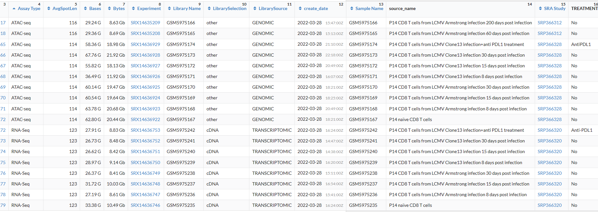

# cancer_res2023 
# Integrative Single-Cell Analysis Reveals Transcriptionaland Epigenetic Regulatory Features of Clear Cell Renal Cell Carcinoma

 
# 复现cancer_res2023中图片  
# [文章](https://pubmed.ncbi.nlm.nih.gov/36607615/)
# 数据：[GSE207493](https://www.ncbi.nlm.nih.gov/geo/query/acc.cgi?acc=GSE207493) 因为该文章数据为bam文件，接下来使用nature immu的数据
# 数据：[GSE199565](https://www.ncbi.nlm.nih.gov/geo/query/acc.cgi?acc=GSE199565)   


 


* 测序：DNA libraries were sequenced by NovaSeq 6000 (Illumina). Consistent with previous studies, we followed the 250 paired-end sequencing scheme: 50 bp read 1N, 8 bp i7 index, 16 bp i5 index, and 50 bp read 2N.  


## 软件下载
```bash
cd /mnt/d/biosoft
curl -o cellranger-atac-2.1.0.tar.gz "https://cf.10xgenomics.com/releases/cell-atac/cellranger-atac-2.1.0.tar.gz?Expires=1680819642&Policy=eyJTdGF0ZW1lbnQiOlt7IlJlc291cmNlIjoiaHR0cHM6Ly9jZi4xMHhnZW5vbWljcy5jb20vcmVsZWFzZXMvY2VsbC1hdGFjL2NlbGxyYW5nZXItYXRhYy0yLjEuMC50YXIuZ3oiLCJDb25kaXRpb24iOnsiRGF0ZUxlc3NUaGFuIjp7IkFXUzpFcG9jaFRpbWUiOjE2ODA4MTk2NDJ9fX1dfQ__&Signature=aVphthCFKlwHmOnTy1AB9Itk6pMya5bFMXqfbkFX7cwalMW9fEkOXdwA3eLyEdg2qgk~mkvjHpondK-RxPsCeAZ~u-8EFTazI3EebAu2uttycmkA-VHceAae37Bbpi9h~eGUb-qhrWvQQkEOzv6q2qlOs94hfQZhY-d~tVwBfeef0ujcQRWG6-Pc90YKbLdhABM3BdXJAZGP14RvZd8XZEyt4byRuXWYyVgIuQAbXzyuSRWJKEfBXoeX3uGBgwXjF3Ha~zacuQNKjBfB4l2ttNisfVVgTVzgBdrkQ8ZXtovnHtktU~rdMcwaGB8yTM8DmGYud0DKhmVD8uU4Hr7pfQ__&Key-Pair-Id=APKAI7S6A5RYOXBWRPDA"
tar -xzvf cellranger-atac-2.1.0.tar.gz
rm cellranger-atac-2.1.0.tar.gz
vim ~/.bashrc
export PATH=/mnt/d/biosoft/cellranger-atac-2.1.0:$PATH
source ~/.bashrc

cellranger-atac sitecheck > sitecheck.txt
cellranger-atac upload xuruizhi30454X@163.com sitecheck.txt
cellranger-atac testrun
```

## 在超算跑
* 将软件及下载好的数据传输到超算
```bash
rsync -av /mnt/d/scATAC/cancer_res2023/ \
wangq@202.119.37.251:/share/home/wangq/xuruizhi/scATAC/cancer_res2023
```
* 超算计算节点配置

型号：Flex X240M5   
2 颗 Intel E5-2680v3 CPU（2.5Ghz 12 核心）   
128GB 内存   
1 块 120GB SSD 盘   
1 个千兆以太网网口   
1 个 56Gb Infiniband 网口  

## 前处理 
[参考  CellRanger ATAC](https://support.10xgenomics.com/single-cell-atac/software/pipelines/latest/what-is-cell-ranger-atac)      

做前处理前，一定先确定好样本测序情况+重复情况，[详细参照](https://support.10xgenomics.com/single-cell-atac/software/pipelines/latest/what-is-cell-ranger-atac)。  

For example, if your experimental design involves `two samples`, you will have to run cellranger-atac count two times - once for each sample. Then you can aggregate them with a single instance of cellranger-atac aggr, as described in [Multi-Library Aggregation](https://support.10xgenomics.com/single-cell-atac/software/pipelines/latest/using/aggr).  


1. bcl2fastq  

* 若已经获得了fastq文件，直接进行下一步即可  

* Preliminary sequencing files (.bcl) were converted to FASTQ files by CellRanger ATAC (version 1.2.0, https://support.10xgenomics.com/single-cell-atac/software/pipelines/
latest/ what-is-cell-ranger-atac) with the `cellranger-atac mkfastq` function.   

* cellranger-atac mkfastq demultiplexes raw base call (BCL) files generated by Illumina® sequencers into FASTQ files. It is a wrapper around bcl2fastq from Illumina®, with additional useful features that are specific to 10x Genomics libraries and a simplified sample sheet format.  

* Note that the term library and GEM well are treated as equivalent.  

```bash
$ cellranger-atac mkfastq --id=tiny-bcl \
                     --run=/path/to/tiny_bcl \
                     --samplesheet=cellranger-atac-tiny-bcl-samplesheet-1.0.0.csv
```
2. 下载测序及基因组数据    

下载`P14 CD8 T cells from LCMV Armstrong infection 15 days post infection`,`P14 CD8 T cells from LCMV Armstrong infection 30 days post infection`两组ATAC-seq及RNA-seq数据。SRR分别为 SRR18505563，SRR18505564，SRR18505387，SRR18505388.  


  

```bash
# sequence
echo "<=== downloading sequence ===>"
mkdir -p /mnt/d/scATAC/cancer_res2023/sequence
mkdir -p /mnt/d/scATAC/cancer_res2023/sequence/ATAC
mkdir -p /mnt/d/scATAC/cancer_res2023/sequence/RNA
cd ~/data/sra
prefetch SRR18505563 SRR18505564 SRR18505387 SRR18505388 #63+64是ATAC-seq
ls -lh

# 将ATAC和RNA分开
cd ~/data/sra
cp SRR18505563.sra /mnt/d/scATAC/cancer_res2023/sequence/ATAC
cp SRR18505564.sra /mnt/d/scATAC/cancer_res2023/sequence/ATAC
cp SRR18505387.sra /mnt/d/scATAC/cancer_res2023/sequence/RNA
cp SRR18505388.sra /mnt/d/scATAC/cancer_res2023/sequence/RNA

# genome 
mkdir -p /mnt/d/scATAC/cancer_res2023/genome
cd /mnt/d/scATAC/cancer_res2023/genome
curl -O https://cf.10xgenomics.com/supp/cell-atac/refdata-cellranger-arc-mm10-2020-A-2.0.0.tar.gz
tar -zxvf refdata-cellranger-arc-mm10-2020-A-2.0.0.tar.gz
rm refdata-cellranger-arc-mm10-2020-A-2.0.0.tar.gz

# 传到超算
rsync -av /mnt/d/scATAC/cancer_res2023/ \
wangq@202.119.37.251:/share/home/wangq/xuruizhi/scATAC/cancer_res2023/
```
3. 格式转换sra2fq
```bash
echo "<=== sra2fz ===>"
# 在超算跑
# 单个样本
/share/home/wangq/bin/fasterq-dump.3.0.0 -O /mnt/d/scATAC/cancer_res2023/sequence/ATAC --split-files --include-technical SRR19987212.sra
# 循环
cd ~/xuruizhi/scATAC/cancer_res2023/sequence/ATAC
bsub -q mpi -n 24 -J sra2fz -o ~/xuruizhi/scATAC/cancer_res2023/sequence/ATAC \
"ls *.sra | while read id;do(/share/home/wangq/bin/fastq-dump.3.0.0 -O ~/xuruizhi/scATAC/cancer_res2023/sequence/ATAC --split-files --include-technical ${id});done"

# RNA暂且不做处理
fastq-dump --split-3 --gzip SRR19987211.sra -O /mnt/d/scATAC/cancer_res2023/sequence/RNA
fastq-dump --split-3 --gzip SRR19987213.sra -O /mnt/d/scATAC/cancer_res2023/sequence/RNA

```