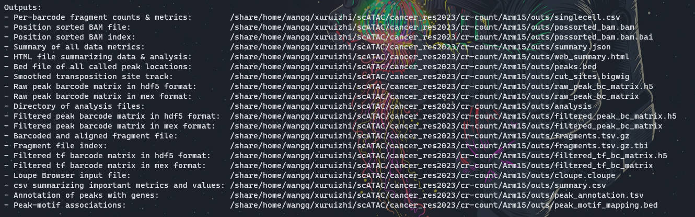

# cancer_res2023 
# Integrative Single-Cell Analysis Reveals Transcriptionaland Epigenetic Regulatory Features of Clear Cell Renal Cell Carcinoma

 
# 复现cancer_res2023中图片  
# [文章](https://pubmed.ncbi.nlm.nih.gov/36607615/)
# 数据：[GSE207493](https://www.ncbi.nlm.nih.gov/geo/query/acc.cgi?acc=GSE207493) 因为该文章数据为bam文件，接下来使用nature immu的数据
# 数据：[GSE199565](https://www.ncbi.nlm.nih.gov/geo/query/acc.cgi?acc=GSE199565)   


 


* 测序：DNA libraries were sequenced by NovaSeq 6000 (Illumina). Consistent with previous studies, we followed the 250 paired-end sequencing scheme: 50 bp read 1N, 8 bp i7 index, 16 bp i5 index, and 50 bp read 2N.  

* [对于sample、flowcell区分](https://mp.weixin.qq.com/s?__biz=MzI1Njk4ODE0MQ==&mid=2247484206&idx=1&sn=edeebbdd092f79361aee87e9ce086d80&chksm=ea1f05acdd688cba4bb00b65e362db843f9867e40421bb334fc13be996c24afb2211a23adbb5&cur_album_id=2757379787522048003&scene=189#wechat_redirect)

## 软件下载
```bash
cd /mnt/d/biosoft
curl -o cellranger-atac-2.1.0.tar.gz "https://cf.10xgenomics.com/releases/cell-atac/cellranger-atac-2.1.0.tar.gz?Expires=1680819642&Policy=eyJTdGF0ZW1lbnQiOlt7IlJlc291cmNlIjoiaHR0cHM6Ly9jZi4xMHhnZW5vbWljcy5jb20vcmVsZWFzZXMvY2VsbC1hdGFjL2NlbGxyYW5nZXItYXRhYy0yLjEuMC50YXIuZ3oiLCJDb25kaXRpb24iOnsiRGF0ZUxlc3NUaGFuIjp7IkFXUzpFcG9jaFRpbWUiOjE2ODA4MTk2NDJ9fX1dfQ__&Signature=aVphthCFKlwHmOnTy1AB9Itk6pMya5bFMXqfbkFX7cwalMW9fEkOXdwA3eLyEdg2qgk~mkvjHpondK-RxPsCeAZ~u-8EFTazI3EebAu2uttycmkA-VHceAae37Bbpi9h~eGUb-qhrWvQQkEOzv6q2qlOs94hfQZhY-d~tVwBfeef0ujcQRWG6-Pc90YKbLdhABM3BdXJAZGP14RvZd8XZEyt4byRuXWYyVgIuQAbXzyuSRWJKEfBXoeX3uGBgwXjF3Ha~zacuQNKjBfB4l2ttNisfVVgTVzgBdrkQ8ZXtovnHtktU~rdMcwaGB8yTM8DmGYud0DKhmVD8uU4Hr7pfQ__&Key-Pair-Id=APKAI7S6A5RYOXBWRPDA"
tar -xzvf cellranger-atac-2.1.0.tar.gz
rm cellranger-atac-2.1.0.tar.gz
vim ~/.bashrc
export PATH=/mnt/d/biosoft/cellranger-atac-2.1.0:$PATH
source ~/.bashrc

cellranger-atac sitecheck > sitecheck.txt
cellranger-atac upload xuruizhi30454X@163.com sitecheck.txt
cellranger-atac testrun
```

## 在超算跑
* 将软件及下载好的数据传输到超算
```bash
rsync -av /mnt/d/scATAC/cancer_res2023/ \
wangq@202.119.37.251:/share/home/wangq/xuruizhi/scATAC/cancer_res2023
```
* 超算计算节点配置

型号：Flex X240M5   
2 颗 Intel E5-2680v3 CPU（2.5Ghz 12 核心）   
128GB 内存   
1 块 120GB SSD 盘   
1 个千兆以太网网口   
1 个 56Gb Infiniband 网口  

## 前处理 
[参考  CellRanger ATAC](https://support.10xgenomics.com/single-cell-atac/software/pipelines/latest/what-is-cell-ranger-atac)      

做前处理前，一定先确定好样本测序情况+重复情况，[详细参照](https://support.10xgenomics.com/single-cell-atac/software/pipelines/latest/what-is-cell-ranger-atac)。  

For example, if your experimental design involves `two samples`, you will have to run cellranger-atac count two times - once for each sample. Then you can aggregate them with a single instance of cellranger-atac aggr, as described in [Multi-Library Aggregation](https://support.10xgenomics.com/single-cell-atac/software/pipelines/latest/using/aggr).  


1. bcl2fastq  

* cellranger mkfastq ： 它借鉴了Illumina的bcl2fastq ，可以将一个或多个lane中的混样测序样本按照index标签生成样本对应的fastq文件。若已经获得了fastq文件，直接进行下一步即可    

* Preliminary sequencing files (.bcl) were converted to FASTQ files by CellRanger ATAC (version 1.2.0, https://support.10xgenomics.com/single-cell-atac/software/pipelines/
latest/ what-is-cell-ranger-atac) with the `cellranger-atac mkfastq` function.   

* cellranger-atac mkfastq demultiplexes raw base call (BCL) files generated by Illumina® sequencers into FASTQ files. It is a wrapper around bcl2fastq from Illumina®, with additional useful features that are specific to 10x Genomics libraries and a simplified sample sheet format.  

* Note that the term library and GEM well are treated as equivalent.  

```bash
$ cellranger-atac mkfastq --id=tiny-bcl \
                     --run=/path/to/tiny_bcl \
                     --samplesheet=cellranger-atac-tiny-bcl-samplesheet-1.0.0.csv
```
2. 下载测序及基因组数据    

下载`P14 CD8 T cells from LCMV Armstrong infection 15 days post infection`,`P14 CD8 T cells from LCMV Armstrong infection 30 days post infection`两组ATAC-seq及RNA-seq数据。SRR分别为 SRR18505563，SRR18505564，SRR18505387，SRR18505388.  


  

```bash
# sequence
echo "<=== downloading sequence ===>"
mkdir -p /mnt/d/scATAC/cancer_res2023/sequence
mkdir -p /mnt/d/scATAC/cancer_res2023/sequence/ATAC
mkdir -p /mnt/d/scATAC/cancer_res2023/sequence/RNA
cd ~/data/sra
prefetch SRR18505563 SRR18505564 SRR18505387 SRR18505388 #63+64是ATAC-seq
ls -lh

# 将ATAC和RNA分开
cd ~/data/sra
cp SRR18505563.sra /mnt/d/scATAC/cancer_res2023/sequence/ATAC
cp SRR18505564.sra /mnt/d/scATAC/cancer_res2023/sequence/ATAC
cp SRR18505387.sra /mnt/d/scATAC/cancer_res2023/sequence/RNA
cp SRR18505388.sra /mnt/d/scATAC/cancer_res2023/sequence/RNA

# genome 
# 这里面包含了基因组、注释源文件，以及cell ranger自己利用mkgtf构建的注释和mkref构建的基因组
mkdir -p /mnt/d/scATAC/cancer_res2023/genome
cd /mnt/d/scATAC/cancer_res2023/genome
curl -O https://cf.10xgenomics.com/supp/cell-atac/refdata-cellranger-arc-mm10-2020-A-2.0.0.tar.gz
tar -zxvf refdata-cellranger-arc-mm10-2020-A-2.0.0.tar.gz
rm refdata-cellranger-arc-mm10-2020-A-2.0.0.tar.gz

# 传到超算
rsync -av /mnt/d/scATAC/cancer_res2023/ \
wangq@202.119.37.251:/share/home/wangq/xuruizhi/scATAC/cancer_res2023/
```
3. 格式转换sra2fq
```bash
echo "<=== sra2fz ===>"
# 在超算跑
# 单个样本
cd ~/xuruizhi/scATAC/cancer_res2023/sequence/ATAC
bsub -q mpi -n 24 -J sra2fz -o ~/xuruizhi/scATAC/cancer_res2023/sequence/ATAC \
"/share/home/wangq/bin/fastq-dump.3.0.0 -O ~/xuruizhi/scATAC/cancer_res2023/sequence/ATAC --split-files --gzip SRR18505563.sra" # Job <8289637>
bsub -q mpi -n 24 -J sra2fz -o ~/xuruizhi/scATAC/cancer_res2023/sequence/ATAC \
"/share/home/wangq/bin/fastq-dump.3.0.0 -O ~/xuruizhi/scATAC/cancer_res2023/sequence/ATAC --split-files --gzip SRR18505564.sra" # Job <8289674>


# RNA暂且不做处理
fastq-dump --split-3 --gzip SRR19987211.sra -O /mnt/d/scATAC/cancer_res2023/sequence/RNA
fastq-dump --split-3 --gzip SRR19987213.sra -O /mnt/d/scATAC/cancer_res2023/sequence/RNA
```
4. 改成符合cell ranger的名字  

cellranger的输入文件格式是fq格式，并且文件的命名也是有要求，文件命名格式如下：  
**[Sample Name]**S1_L00**[Lane Number]****[Read Type]**_001.fastq.gz  
* I1: Dual index i7 read (optional)
* R1: Read 1
* R2: Dual index i5 read
* R3: Read 2    
[详细介绍](https://mp.weixin.qq.com/s?__biz=MzI1Njk4ODE0MQ==&mid=2247484179&idx=1&sn=fe84f5243a6021fe6afea128e3ac273a&chksm=ea1f0591dd688c8780d4e68a1d5838a5fca79b19f13587751112c57eae8d605d79680a787c00&scene=21#wechat_redirect),[各种文件格式命名方法](https://mp.weixin.qq.com/s?__biz=MzI1Njk4ODE0MQ==&mid=2247484355&idx=1&sn=7860fe0c46073a55d2d3700822c3103b&chksm=ea1f0541dd688c57245c175fb1869158993f83fcdd9693c5d6c98de890ff5c1969c355f5c330&cur_album_id=2757379787522048003&scene=189#wechat_redirect)重新创建一个目录并且用软连接将原始文件链接到新的目录中。  

```bash
cd  ~/xuruizhi/scATAC/cancer_res2023/sequence/ATAC
mkdir -p ~/xuruizhi/scATAC/cancer_res2023/sequence/namedATAC
# 通过查阅长度判断分别为什么文件
$ gzip -dc SRR18505563_1.fastq.gz | head -n 6
# @SRR18505563.1 A00303:76:HHWJ7DMXX:1:1101:1127:1000 length=49
$ gzip -dc SRR18505563_2.fastq.gz | head -n 6
# @SRR18505563.1 A00303:76:HHWJ7DMXX:1:1101:1127:1000 length=16 该文件为i5 index
$ gzip -dc SRR18505563_3.fastq.gz | head -n 6
# @SRR18505563.1 A00303:76:HHWJ7DMXX:1:1101:1127:1000 length=49

# 通过软连接移入新文件夹并改名
bsub -q mpi -n 24 -J named -o ~/xuruizhi/scATAC/cancer_res2023/namedATAC \
"cp ./SRR18505563_1.fastq.gz ../namedATAC/Arm15_S1_L001_R1_001.fastq.gz
cp ./SRR18505563_2.fastq.gz ../namedATAC/Arm15_S1_L001_R2_001.fastq.gz
cp ./SRR18505563_3.fastq.gz ../namedATAC/Arm15_S1_L001_R3_001.fastq.gz
cp ./SRR18505564_1.fastq.gz ../namedATAC/Arm30_S1_L001_R1_001.fastq.gz
cp ./SRR18505564_2.fastq.gz ../namedATAC/Arm30_S1_L001_R2_001.fastq.gz
cp ./SRR18505564_3.fastq.gz ../namedATAC/Arm30_S1_L001_R3_001.fastq.gz"

# 批量修改
cat SRR_.txt | while read i ;do 
(mv ${i}_1*.gz ${i}_S1_L001_R1_001.fastq.gz;mv ${i}_2*.gz ${i}_S1_L001_R2_001.fastq.gz;mv ${i}_3*.gz ${i}_S1_L001_R3_001.fastq.gz);done
```
可选：[fastqc 查看质量](https://mp.weixin.qq.com/s?__biz=MzI1Njk4ODE0MQ==&mid=2247484206&idx=1&sn=edeebbdd092f79361aee87e9ce086d80&chksm=ea1f05acdd688cba4bb00b65e362db843f9867e40421bb334fc13be996c24afb2211a23adbb5&cur_album_id=2757379787522048003&scene=189#wechat_redirect)  
```bash
mkdir ~/xuruizhi/scATAC/cancer_res2023/QC
cd ~/xuruizhi/scATAC/cancer_res2023/sequence/namedATAC/
bsub -q mpi -n 24 -J QC -o ~/xuruizhi/scATAC/cancer_res2023/QC \
"ls *.fastq.gz | while read ${id}; do(/share/home/wangq/.linuxbrew/bin/fastqc ${id} -o ~/xuruizhi/scATAC/cancer_res2023/QC);done"
# 因为java配置没有成功
```
5. cellranger count  

* 利用mkfastq生成的fq文件，进行比对、过滤、UMI计数。利用细胞的barcode生成gene-barcode矩阵，后续进行样本分群、基因表达分析。  


```bash
mkdir ~/xuruizhi/scATAC/cancer_res2023/cr-count
cd ~/xuruizhi/scATAC/cancer_res2023/cr-count
# 写脚本
$ cat >run-cellranger_mm10.sh <<EOF
# bin = ~/xuruizhi/cellranger-atac-2.1.0/cellranger-atac
# db = ~/xuruizhi/scATAC/cancer_res2023/genome/refdata-cellranger-arc-mm10-2020-A-2.0.0
# fq_dir = ~/xuruizhi/scATAC/cancer_res2023/sequence/namedATAC

~/xuruizhi/cellranger-atac-2.1.0/cellranger-atac count --id $1 --reference ~/xuruizhi/scATAC/cancer_res2023/genome/refdata-cellranger-arc-mm10-2020-A-2.0.0 \
--fastqs ~/xuruizhi/scATAC/cancer_res2023/sequence/namedATAC --sample $1
EOF

# 脚本执行失败，还是一个个来吧
bsub -q mpi -n 24 -J cr-count -o ~/xuruizhi/scATAC/cancer_res2023/cr-count \
"~/xuruizhi/cellranger-atac-2.1.0/cellranger-atac count --id Arm15 --reference ~/xuruizhi/scATAC/cancer_res2023/genome/refdata-cellranger-arc-mm10-2020-A-2.0.0 \
--fastqs ~/xuruizhi/scATAC/cancer_res2023/sequence/namedATAC --sample Arm15 1>log_Arm15.txt 2>&1"
# Job <8314173>

bsub -q mpi -n 24 -J cr-count -o ~/xuruizhi/scATAC/cancer_res2023/cr-count \
"~/xuruizhi/cellranger-atac-2.1.0/cellranger-atac count --id Arm30 --reference ~/xuruizhi/scATAC/cancer_res2023/genome/refdata-cellranger-arc-mm10-2020-A-2.0.0 \
--fastqs ~/xuruizhi/scATAC/cancer_res2023/sequence/namedATAC --sample Arm30 1>log_Arm30.txt 2>&1"
# Job <8314199>
```
* output  
  
  
  
Once cellranger-atac count has successfully completed, you can browse the resulting `[summary HTML file](https://support.10xgenomics.com/single-cell-atac/software/pipelines/latest/output/summary)` in any supported web browser, open the `.cloupe` file in `[Loupe Browser](https://support.10xgenomics.com/single-cell-atac/software/visualization/latest/cellranger-atac)`, or refer to the Understanding Output section to explore the data by hand.    


* 结果解读（参考生信技能树Jimmy的帖子）：
```bash
# 通过beyond compare将结果文件传输到本地查看、进行下游分析  
mkdir -p /mnt/d/scATAC/cancer_res2023/cr-count/Arm15
mkdir -p /mnt/d/scATAC/cancer_res2023/cr-count/Arm30
rsync -av wangq@202.119.37.251:/share/home/wangq/xuruizhi/scATAC/cancer_res2023/cr-count/Arm15/ \
/mnt/d/scATAC/cancer_res2023/cr-count/Arm15

rsync -av wangq@202.119.37.251:/share/home/wangq/xuruizhi/scATAC/cancer_res2023/cr-count/Arm30/ \
/mnt/d/scATAC/cancer_res2023/cr-count/Arm30

# web_summary.html：必看，官方说明 summary HTML file ，包括许多QC指标，预估细胞数，比对率等；
# summary.csv：CSV格式数据摘要，可以不看；
# possorted_genome_bam.bam：比对文件，用于可视化比对的reads和重新创建FASTQ文件，可以不看；
# possorted_genome_bam.bam.bai：索引文件；
# filtered_gene_bc_matrices：是重要的一个目录，下面又包含了 barcodes.tsv.gz、features.tsv.gz、matrix.mtx.gz，是下游Seurat、Scater、Monocle等分析的输入文件，是经过Cell Ranger过滤后构建矩阵所需要的所有文件；
# filtered_feature_bc_matrix.h5：过滤掉的barcode信息HDF5 format，可以不看；
# raw_feature_bc_matrix：原始barcode信息，未过滤的可以用于构建矩阵的文件，可以不看；
# raw_feature_bc_matrix.h5：原始barcode信息HDF5 format，可以不看；
# analysis：数据分析目录，下面又包含聚类clustering（有graph-based & k-means）、差异分析diffexp、主成分线性降维分析pca、非线性降维tsne，因为我们自己会走Seurat流程，所以不用看；
# molecule_info.h5：可用于整合多样本，使用cellranger aggr函数；
# cloupe.cloupe：官方可视化工具Loupe Cell Browser 输入文件，无代码分析的情况下使用，会代码的同学通常用不到。
```  

* 文件整理：
其中最重要的outs为 `filtered_feature_bc_matrix` 文件夹里面的内容， 以及 `web_summary.html` 这个报表.  
```bash
mkdir -p /mnt/d/scATAC/cancer_res2023/cr-count/html 
cd /mnt/d/scATAC/cancer_res2023/cr-count
ls */outs/web_summary.html |while read id;do (cp $id /mnt/d/scATAC/cancer_res2023/cr-count/html/${id%%/*}.html );done
# 文件目录有问题
mkdir -p /mnt/d/scATAC/cancer_res2023/cr-count/matrix 
ls -d */outs/filtered_feature_bc_matrix |while read id;do (cp -r  $id /mnt/d/scATAC/cancer_res2023/cr-count/matrix/${id%%/*} );done
```


6. cellranger aggr   

当处理多个生物学样本或者一个样本存在多个重复/文库时，最好的操作就是先分别对每个文库进行单独的count定量，然后将定量结果利用aggr组合起来。   

本文没有技术重复和生物学重复。可以参照其他文章中分别call peak，对peak进行筛选。  

  


```bash
#  得到count结果
$ cellranger count --id=LV123 ...
... wait for pipeline to finish ...
$ cellranger count --id=LB456 ...
... wait for pipeline to finish ...
$ cellranger count --id=LP789 ...
... wait for pipeline to finish ...

# 构建Aggregation CSV
# AGG123_libraries.csv
library_id,molecule_h5
LV123,/opt/runs/LV123/outs/molecule_info.h5
LB456,/opt/runs/LB456/outs/molecule_info.h5
LP789,/opt/runs/LP789/outs/molecule_info.h5
# 其中
# molecule_h5：文件molecule_info.h5 file的路径

# 运行aggr
cellranger aggr --id=AGG123 \
                 --csv=AGG123_libraries.csv \
                 --normalize=mapped
# 结果输出到AGG123这个目录中
```
上游流程就到此为止啦，接下来就是读取每个样品的表达量矩阵去R语言里面跑seurat流程，每个样品都是3个文件组成的表达量矩阵.  

7. [可选！] Loupe Cell Browser可视化    


7. 细胞聚类  

细胞聚类看前后比例变化  

```r
# 先安装好需要的软件
if (!require("BiocManager", quietly = TRUE))
    install.packages("BiocManager")
BiocManager::install("Signac")
BiocManager::install("Seurat")
BiocManager::install("GenomeInfoDb")
BiocManager::install("ggplot2")
BiocManager::install("patchwork")
BiocManager::install("GenomicRanges")
BiocManager::install("future")
BiocManager::install("harmony")


library(Signac)
library(Seurat)
library(GenomeInfoDb)
# library(EnsDb.Hsapiens.v75)
library(ggplot2)
library(patchwork)
# set.seed(1234)
library(GenomicRanges)
library(future)
library(harmony)

```